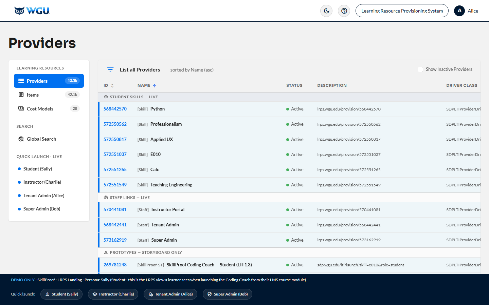

<div align="center">

# JFT SDP — Skill Development Platform

**Medium-fidelity storyboard for WGU's AI-powered Python coding coach + the administrative surfaces around it**

[](https://brady-wgu.github.io/JFT_SDP/)
[](https://brady-wgu.github.io/JFT_SDP/presentation.html)
[](https://brady-wgu.github.io/JFT_SDP/presentation_dark.html)
[](CHANGELOG.md)
[]()
[]()



*A medium-fidelity sample — not a pixel-perfect specification. Built with Claude Code on the [SDP Design System v1.2](https://github.com/openedx/paragon) (Paragon / Open edX) with WGU FY26 brand tokens.*

</div>

---

## Overview

The **JFT Skill Development Platform (SDP)** is WGU's AI-powered Python coding coach for students, plus the administrative surfaces around it. This repo holds the **medium-fidelity storyboard** that JFT (Jellyfish Technologies) builds against — a self-contained, offline-capable visual sample of all the major surfaces:

- **Sally** (Student) — the v1.2 MVP coaching loop. **JFT shipped this first.** ([student/](student/))
- **Alice** (Content Creator / PDev content owner; SOW §2.2 role: Tenant Admin) — Course-as-a-Service portal with per-LO threshold + weight + Add/Edit/Remove LO flows, Configure AI Coaching Prompt, LRPS provisioning workflow, Critical Incident Response. ([tenant_admin/](tenant_admin/))
- **Charlie** (Instructor) — At-Risk Intervention dashboard. ([instructor/](instructor/))
- **Bob** (Super Admin / Platform Operations) — Governance & Cost Audit. ([super_admin/](super_admin/))
- Plus **LRPS Landing** ([lrps/](lrps/)) — recreated WGU internal Learning Resource Provisioning System; the realistic entry point for all three admin portals.

Each persona has its own **secret LRPS deep link** in production and authenticates separately. They share the SDP Design System v1.2 chrome and the WGU FY26 brand so the suite reads as one cohesive product family.

> **Note for JFT:** The Tenant Admin, Instructor, and Super Admin scenarios are the design spec for surfaces JFT has not yet started building. Use this storyboard as the visual North Star, not a frozen contract. The first JFT release was an MVP and will be iterated on several times during the contract.

### Surfaces

| Surface | URL | Description |
|:--------|:----|:------------|
| **Portal Selector** | [`/`](https://brady-wgu.github.io/JFT_SDP/) | Landing page with cards for every surface. **Start here.** |
| **LRPS Landing** | [`/lrps/`](https://brady-wgu.github.io/JFT_SDP/lrps/) | Entry point for all four personas (4 live SDP rows + illustrative filler). |
| **Student Storyboard** | [`/student/`](https://brady-wgu.github.io/JFT_SDP/student/) | Sally's coaching loop — the v1.2 MVP. 34 screens. |
| **Content Creator Portal** (SOW §2.2: Tenant Admin) | [`/tenant_admin/`](https://brady-wgu.github.io/JFT_SDP/tenant_admin/) | Alice — course config with per-LO threshold + weight + Add/Edit/Remove LO flows, Configure AI Coaching Prompt with file upload, deploy + LRPS provisioning, incident response, plus three Tenant Settings (Branding · Instructor Roster · Subject Lifecycle). Read-only view of other tenants on portal home. 23 screens. |
| **Instructor Dashboard** | [`/instructor/`](https://brady-wgu.github.io/JFT_SDP/instructor/) | Charlie — class heatmap → Sally drill-down → Audit Trail. 8 screens. |
| **Super Admin Portal** | [`/super_admin/`](https://brady-wgu.github.io/JFT_SDP/super_admin/) | Bob (Global Admin) — token usage, rate limits, compliance, geo-redundancy, cross-tenant audit log, **User Management** (3-tier role upgrade with min-2-Global-Admins constraint). 9 screens. |
| **Scenario Catalog (Light)** | [`/presentation.html`](https://brady-wgu.github.io/JFT_SDP/presentation.html) | All 9 scenarios with workflow narratives and embedded screenshots. |
| **Scenario Catalog (Dark)** | [`/presentation_dark.html`](https://brady-wgu.github.io/JFT_SDP/presentation_dark.html) | Same catalog, dark-theme screenshots. |

**Total: 74 screens · 4 personas · 5 admin/learner surfaces · 1 LRPS entry · 2 reference catalogs.**

---

## Repo layout

```
JFT_SDP/
├── index.html                  Portal selector landing
├── presentation.html           Scenario catalog (light)
├── presentation_dark.html      Scenario catalog (dark)
├── capture_screens.py          Playwright screenshot pipeline
├── README.md                   This file
├── CHANGELOG.md                Version history
├── assets/
│   ├── wgu-corporation-*.png  WGU FY26 corporate logos (3 variants)
│   └── landing/                Portal-selector hero screenshots
├── student/                    v1.2 MVP — Sally
│   ├── index.html
│   ├── README.md
│   ├── screenshots/            34 PNGs (light)
│   └── screenshots_dark/       34 PNGs (dark)
├── tenant_admin/               v1.3 — Alice (extended in v4.4)
│   ├── index.html
│   ├── README.md
│   ├── screenshots/            27 PNGs
│   └── screenshots_dark/       27 PNGs
├── instructor/                 v1.3 — Charlie
│   ├── index.html
│   ├── README.md
│   ├── screenshots/            8 PNGs
│   └── screenshots_dark/       8 PNGs
├── super_admin/                v1.3 — Bob
│   ├── index.html
│   ├── README.md
│   ├── screenshots/            8 PNGs
│   └── screenshots_dark/       8 PNGs
└── lrps/                       Entry point for the 3 admin portals
    ├── index.html
    ├── README.md
    ├── screenshots/            1 PNG (the LRPS page itself)
    └── screenshots_dark/       1 PNG
```

Click any persona folder to read its dedicated README.

---

## Persona sections

### 🎓 Student (v1.2 MVP) — Sally

**Surface:** [`student/`](student/) · [Live](https://brady-wgu.github.io/JFT_SDP/student/) · [README](student/README.md)

**Persona:** Sally — Beginner / Intermediate / Advanced Python knowledge. Launches via LTI 1.3 from her zyBooks course page.

**Scope:** This is the **v1.2 MVP scope** — the first JFT release. It deploys the existing Cicada v1 proof-of-concept codebase to production-quality, scalable infrastructure with a polished UI, accessible outside the WGU intranet via LTI 1.3 SSO. No new features, adaptive logic changes, or coaching algorithm modifications are in scope for this v1.2 release.

**Scenarios (4, 34 screens):**

| ID | Flow | Screens | Description |
|:---|:-----|:-------:|:------------|
| **SC-MVP-01** | Basic | 8 | First launch. New student with no Python knowledge. Diagnostic → progress map → first coaching task → save. |
| **SC-MVP-02** | Advanced | 11 | Progressive coaching. Partial Python knowledge. Diagnostic → coaching → incorrect-answer feedback → verification → difficulty advance. |
| **SC-MVP-03** | Professional | 9 | Experienced developer fast-tracks. Diagnostic shows mastery; one verification task for Functions & Modular Programming. |
| **SC-MVP-04** | Returning | 6 | Returns after multi-week break. Prior progress preserved. Re-assessment verifies retention before resuming. |

**Source:** JFT SDP MVP Scenario Catalog v1.2 (07 Apr 2026).

**v1.2 catalog alignment:** 100% (34/34 screens depict every step described in the catalog). UX detail beyond the visual design — `Need a Hint?` interaction, persistent session-stats display, fast-track threshold reasoning, re-assessment retention framing — is elaborated in [`presentation.html`](presentation.html). Honest call-outs of what v1 does **not** depict (no real Python execution, no mid-task pause, no error recovery, no re-assessment failure path, etc.) are enumerated in [student/README.md](student/README.md#v1-known-limitations). The v1 student screens are deliberately frozen as a baseline — see that file for the full list of v1.4+ candidate gaps.

---

### 🏢 Content Creator (Tenant Admin per SOW §2.2) (v1.3) — Alice

**Surface:** [`tenant_admin/`](tenant_admin/) · [Live](https://brady-wgu.github.io/JFT_SDP/tenant_admin/) · [README](tenant_admin/README.md)

**Persona:** Alice — WGU Program Development (PDev) content owner. The SOW calls this role **"Tenant Admin"** (§2.2 deliverable, §2.5 admin portal). Alice's user-facing portal chrome calls it **"Content Creator"** per JFT meeting 10 May 2026 — same role, two names for ease of explanation to non-technical stakeholders. Authenticates via her own secret LRPS deep link.

**Scope:** Multi-tenancy + RBAC + Course-as-a-Service course authoring (Subjects, Topics, Learning Objectives with per-LO threshold + weight + Add/Edit/Remove flows), AI coaching prompt configuration, model selection, scoring style, CI/CD-driven deploys, post-deploy manual LRPS provisioning ticket workflow, and the Support Plan / SLA workflow (SC-ADD-06).

**Scenarios (2, 24 screens):**

| ID | Description | Screens |
|:---|:------------|:-------:|
| **SC-ADD-02** | **Content Creator Portal & Course Configuration.** Multi-tenant scoping (§16.3 #8.6), Subject creation, **Topics & Learning Objectives with per-LO threshold + weight**, **Add / Edit / Remove LO flows** (3 illustration screens), **Configure AI Coaching Prompt** (4 short text-box guardrails + hallucination warning), model picker, Scoring Style & coaching defaults, deploy via CI/CD, **post-deploy LRPS provisioning ticket workflow**. Plus four Tenant Settings: Branding · Team & Roles · Instructor Roster · Subject Lifecycle. | 16 |
| **SC-ADD-06** | **Critical Incident Response & SLA.** Primary LLM provider down → fallback engaged → P1 ticket in **Jira** (§9.1 + §9.4) → JFT Support 2-hr P1 response per §9.5 → service restored → 99.95% uptime SLA verified. | 8 |

**Source:** JFT SDP User Scenario Catalog: Additional Scenarios v1.3 (05 May 2026).

---

### 👨‍🏫 Instructor (v1.3) — Charlie

**Surface:** [`instructor/`](instructor/) · [Live](https://brady-wgu.github.io/JFT_SDP/instructor/) · [README](instructor/README.md)

**Persona:** Charlie — Instructor (per User Profile + SOW §2.5) for E010 Foundations of Programming (Python), E075 Intermediate Python & Libraries, and E135 OOP with Python.

**Scope:** Educator-facing analytics and learner engagement tracking. The SDP is a practice tool — coaching scores never feed academic records.

**Scenarios (1, 8 screens):**

| ID | Description | Screens |
|:---|:------------|:-------:|
| **SC-ADD-03** | **Instructor Dashboard & At-Risk Intervention.** Course overview → class heatmap (15 learners × 4 competencies, 9-step color scale; export CTAs per §7.14) → at-risk filter → Sally drill-down → conversation transcript with AI feedback → Audit Trail event log. | 8 |

**Source:** JFT SDP User Scenario Catalog: Additional Scenarios v1.3 (05 May 2026).

---

### 🛡️ Super Admin (v1.3) — Bob

**Surface:** [`super_admin/`](super_admin/) · [Live](https://brady-wgu.github.io/JFT_SDP/super_admin/) · [README](super_admin/README.md)

**Persona:** Bob — WGU platform operations and infrastructure. Authenticates with MFA in addition to SSO.

**Scope:** Cross-tenant governance, financial controls, security compliance, global resource management.

**Scenarios (1, 8 screens):**

| ID | Description | Screens |
|:---|:------------|:-------:|
| **SC-ADD-04** | **Super Admin Governance & Cost Audit.** Cross-tenant overview → token usage tracking → cost-spike drill-down → global rate limits → TLS 1.3 + FERPA compliance report → geo-redundancy status → cross-tenant audit log. | 8 |

**Source:** JFT SDP User Scenario Catalog: Additional Scenarios v1.3 (05 May 2026).

---

### 🚪 LRPS Landing (Entry Point)

**Surface:** [`lrps/`](lrps/) · [Live](https://brady-wgu.github.io/JFT_SDP/lrps/) · [README](lrps/README.md)

**Persona:** Lana (the fictional LRPS admin who provisions the deep links) or any WGU staff with LRPS access.

**Scope:** A recreation of WGU's internal Learning Resource Provisioning System, styled in the SDP Design System v1.2. Each of the three admin portals has its own provider row in this table; clicking the row deep-links into the corresponding portal. JFT does not build LRPS — it is modeled here only to make the deep-link source feel authentic.

The LRPS surface includes:
- 4 live SDP rows (Student, Tenant Admin, Instructor, Super Admin) — clickable, deep-linked
- Illustrative filler rows (OEX modules, zyBooks, Pearson, ProctorU, Cicada legacy, Panopto, etc.) for realistic LRPS density
- A meta-bar quick-launch with chips to all 5 surfaces + the catalog

---

## Shared persona & course reference

Canonical strings used across all 5 surfaces. Use these verbatim when adding new screens, narrative, or test fixtures so the storyboard remains internally consistent. (Drift here is the most common source of bugs — e.g., a Tenant Admin screen that calls Sally's course "E010" while the Instructor heatmap calls it "Foundations of Programming".)

| String | Canonical value | Notes |
|:-------|:----------------|:------|
| **Student persona** | `Sally` | First name only. Avatar initial: `S`. Used in LTI 1.3 `name` claim. Knowledge level (Beginner / Intermediate / Advanced / Returning) varies by scenario; the persona is the same Sally across all four. |
| **Course code** | `E010` | Course code for "Foundations of Programming (Python)". |
| **Course title** | `Foundations of Programming (Python)` | Or short form `Python Foundations` in tight UI chrome. Never abbreviate to "FoP" in user-facing copy. |
| **Enrollment model** | `Rolling enrollment` | Per the User Profile, WGU has no fixed cohorts or sections. Every learner enters on their own day and progresses at their own rate. Avoid "Section 042" / "Spring 2026" framing in any new screen copy — talk about *active learners in a course* instead. |
| **Tenant** | `PDev` | Program Development. Lowercase tenant slug: `pdev`. Alice (Tenant Admin) owns this tenant. |
| **Tenant display name** | `Program Development` | When spelled out (e.g., audit log entries, tenant scoping callouts). |
| **LMS course identifier** | `WGUE010PythonAY2026` | The LRPS-registered LMS course slug zyBooks renders. Visible on Screen 1 of every SC-MVP scenario. |
| **13 sub-sections** | Basic Syntax & Data Types · Control Flow & Logic · Data Structures: Lists, Tuples, Sets, Dictionaries · Functions & Modular Programming · Object-Oriented Programming · Error Handling & Exceptions · File I/O & Persistence · Iterators & Generators · Decorators & Closures · Concurrency Basics · Standard Library Essentials · Testing & Debugging · Packaging & Environments | The full Cicada v1 SDP sub-section taxonomy. Order is significant: Progress Map renders in this order. |
| **Cost-spike date (SC-ADD-04)** | `04 May 2026` | Bob's cost audit drill-down references this date as the spike origin. |
| **Storyboard version** | `v4.x` | Tracks the visual prototype, not the underlying SDP product. SDP product versions follow the catalog: v1.2 MVP, v1.3 Additional, etc. |

If you need to change any of these, update them everywhere in the same commit — `Glob` for the literal string across all 5 portals, `presentation.html` / `presentation_dark.html`, and all per-persona READMEs before opening the PR.

---

## Design System

The storyboard implements the **SDP Design System v1.2**, a brand theme layer on top of [Paragon](https://github.com/openedx/paragon) (Open edX's open-source design system).

| Layer | Responsibility |
|:------|:--------------|
| **Paragon** | Component structure, accessibility, base CSS (`@openedx/paragon`) |
| **WGU Brand Tokens** | Color, typography, spacing overrides (`--pgn-*` CSS custom properties) |
| **SDP Product** | Page composition, content structure, learning interactions |

### Color Palette (WGU FY26 — Authoritative)

| Token | Hex | Role |
|:------|:----|:-----|
| Deep Navy | `#001730` | Primary dark background, navbar, headers |
| Dark Navy | `#002855` | Deep accent, logo gradient |
| Bright Blue | `#0070F0` | Primary actions, CTAs, links |
| Sky Blue | `#46B1EF` | Secondary blue, accents, progress |
| Ice Blue | `#EEF6F9` | Light surface backgrounds |
| Accent Red | `#C13232` | Error states, emphasis |
| Amber | `#FBAE40` | Warnings, section accents |

Where FY26 and SDP Figma tokens conflict, **FY26 takes precedence**.

#### Documented palette extensions (intentional; out of FY26 scope)

Two specialized UI domains use deliberately extended palettes for clarity and industry familiarity. **These are intentional and must NOT be expanded to other surfaces.** Implementers should keep these scoped to their declared domains:

| Domain | Tokens | Where used | Justification |
|:---|:---|:---|:---|
| **Code-block syntax highlighting** | GitHub-style: `--code-keyword: #ff7b72`, `--code-function: #79c0ff`, `--code-string: #a5d6ff`, `--code-bg: #0d1117`, `--code-border: #30363d` | `tenant_admin/index.html` (REST API JSON examples on screens 11–13); `student/index.html` (read-only Python code editors) | Industry-standard code coloring (matches GitHub / VS Code dark themes). FY26 navy/blue would be unreadable for code tokens. |
| **Heatmap gradient** (9-step) | `--heat-1` through `--heat-9` (red → green via amber midpoints) | `instructor/index.html` screen 3 (15-learner × 4-competency class heatmap) | Sequential data visualization needs perceptually distinct steps; FY26 has no diverging-scale tokens. |

All other surfaces (navbars, cards, forms, alerts, badges, status pills) use canonical FY26 tokens only.

### Typography

- **Headings:** Sora Bold (H1 40, H2 32, H3 28, H4 24, H5 20)
- **Body:** Lato Regular 16px / 1.5 line-height
- **Code blocks:** Lato 14px on `#0d1117` for JSON/API consoles; SDP-palette syntax in light mode for student code blocks
- **Type scale:** strict 12 / 14 / 16 / 18 / 20 / 24 / 28 / 32 / 40 / 48 px

### Spacing

8-point grid throughout. All padding, margin, and gap values are multiples of 8px.

### Branding

- Real **WGU FY26 Corporation logos** in [`assets/`](assets/) (White, Full Color, Full Color Reverse)
- **Theme-aware logo swap:** Full Color Reverse on light theme, White on dark theme — both render correctly on the navy header
- **Wordmark text dropped** — the logo stands alone (per WGU's branding rule)

---

## How to use

### Online

The portal selector at [brady-wgu.github.io/JFT_SDP/](https://brady-wgu.github.io/JFT_SDP/) links to every surface. From there you can open any portal directly, or open LRPS first and click into a portal via its provider row.

### Offline

Clone the repo and open `index.html` in any modern browser. No build step, no server required (the screenshot pipeline is the only thing that needs a local HTTP server). Files are fully self-contained beyond Google Fonts (Sora + Lato + Material Icons Outlined).

### Regenerate screenshots

```bash
# 1. From the repo root, start a local HTTP server
python -m http.server 63417

# 2. In another terminal
python capture_screens.py
```

Output: 148 PNGs total — 74 per theme, distributed across the 5 per-persona `screenshots/` and `screenshots_dark/` subdirs.

---

## Source documents

| Document | Version | Date |
|:---------|:--------|:-----|
| JFT SDP User Scenario Catalog: Additional Scenarios | v1.3 | 05 May 2026 |
| JFT SDP MVP Scenario Catalog | v1.2 | 07 Apr 2026 |
| JFT SDP User Profiles | v1.2 | 30 Mar 2026 |
| SDP Design System Specification | v1.2 | 30 Mar 2026 |
| WGU FY26 Design System Specification | v1.0 | 25 Mar 2025 |
| WGU Design Systems Differential Analysis | v2.0 | 16 Apr 2026 |

Upstream design system: [@openedx/paragon](https://github.com/openedx/paragon) (release-23.x, v23.19.1).

---

## For developers (JFT)

This storyboard is a **medium-fidelity sample**, not production code or a pixel-perfect specification. It illustrates the general look and feel of the SDP and its administrative surfaces on a desktop browser. Use it as a rough guide for the intended user experience — adapt as needed for the production implementation.

When implementing:

1. **Install Paragon** — `npm install @openedx/paragon`
2. **Apply WGU brand tokens** via the brand package override mechanism (`@wgu/sdp-brand`)
3. **Use Paragon React components** — do not rebuild them. The storyboard's CSS class names (`.pgn__card`, `.btn-primary`, `.pgn__breadcrumb`, etc.) map directly to Paragon's component schema.
4. **Per-persona portals are separately authenticated surfaces** — each has its own LRPS deep link. Tenant Admin, Instructor, and Super Admin should not be combined into a single SPA shell; the auth flow and RBAC scoping are role-bound.
5. **Tenant Admin owns three v1.3 scenarios in one portal** — the screens compose into a single Tenant Admin experience but are documented separately in the catalog.
6. The CSS custom properties in the portal HTML files (`--pgn-*`) map directly to the Paragon token schema.
7. Each persona's [`README.md`](#repo-layout) lists the specific patterns and components introduced for that surface.

---

## Changelog

See [CHANGELOG.md](CHANGELOG.md) for the full version history.

The latest release is **v4.18** — SOW-anchored sweep. WGU Program Development provided the **literal signed MSA/SOW** (`JFT_WGU_MSA_SOW_signed_05MAY2026.md`); reading the actual contract revealed both **over-trims** (items I removed that are explicitly committed in SOW Appendix A) and **gaps** (contract-grounded features the storyboard never depicted). v4.18 closes both directions in a single batched release. **Restored:** Jira ticketing (§9.1 + §9.4 + §13), vendor-named `model.invoke` in audit log (§16.1 #6.1 explicitly names Claude/OpenAI/Gemini), and PDF + XML export formats (§16.2 #7.14 + §16.3 #8.9). **Added:** real-time webhooks (§16.3 #8.12 + §3.19), GraphQL alongside REST (§16.1 #6.28 + §16.3 #8.13), A/B testing framework for LLM configs (§16.1 #6.8), LaTeX rendering (§16.1 #6.12), default locale + PWA badges (§16.2 #7.6 + #7.7 + §3.7), and 10 new rows on the super_admin Compliance Report FERPA control table covering SOC 2 / ISO 27001 / zero-trust / GDPR / annual pentest / AES-256 at rest / MFA / SIEM / vuln scan + 48-hr patch SLA / BC-DR (§16.5 #10.6, #10.13, #10.14, #10.12, #10.10, #10.16, #10.18, #10.15, #10.9 + #10.19, #10.20). **Kept trimmed:** AWS zone IDs, WGU Policy 8.x, WGU Learning Hub, "1,247 sessions" + "47 operators" + "14 endpoints" + "7 years" + TLS cipher names + named internal services + "JFT 24/7" service-name prefix — none of these are in the SOW. No screens removed (still 77); all in-place text edits + small section additions within existing screens.

---

<div align="center">

**Western Governors University** | Program Development | JFT SDP

*WGU confidential / proprietary. Do not redistribute without authorization.*

</div>
