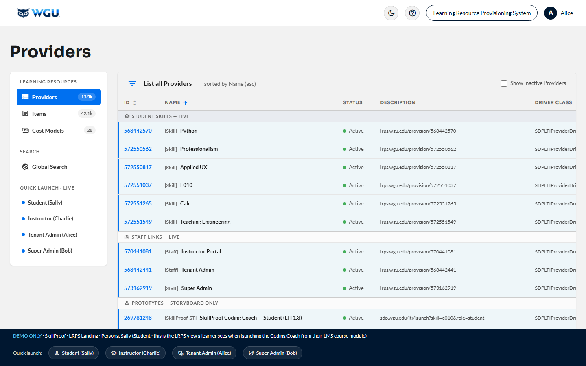

<div align="center">

# SkillProof

**Live-app click-through demo of WGU's AI coaching platform, plus the medium-fidelity storyboard for the administrative surfaces around it**

[](https://brady-wgu.github.io/SkillProof/)
[](CHANGELOG.md)
[]()
[]()



*A medium-fidelity sample — not a pixel-perfect specification. Built with Claude Code on the [SkillProof Design System v1.2](https://github.com/openedx/paragon) (Paragon / Open edX) with WGU FY26 brand tokens.*

</div>

---

## Overview

> **Update · 13 Aug 2026 — the demo is a login-free stand-in for a live walkthrough of all four roles.**
> `student/`, `instructor/`, `tenant_admin/` and `super_admin/` are **click-through pages built from real screenshots of the working app** (`wgu.teamjft.com`), generated by [`build_prototypes.py`](build_prototypes.py) from a per-persona `flow.json`. Transparent, percentage-positioned hotspots sit over the real controls and call `goToScreen()` to advance.
>
> Three things changed on 13 Aug 2026, all in response to the demo being unusable as a stand-in:
> - **The AI interaction loop is now included.** Earlier revisions had no screen showing a model-generated question or a graded answer, which is the reason the platform exists.
> - **Every persona is on one course** — STU101 inside course folder B002 — so switching roles follows the same course through student, instructor and admin views.
> - **Each screen fills the browser width and scrolls inside its own frame**, so a 1,080px dashboard and a 6,100px analytics rollup present as the same shape instead of resizing the page on every click.
>
> The earlier hand-built HTML mockups are **preserved, not deleted**, in [`_archive/`](_archive/) — and **not served on the live site at all**: GitHub Pages runs Jekyll, which excludes any path beginning with an underscore, so every `_archive/` URL returns 404. They are preserved in the repository and viewable by cloning or serving locally. (Corrected in v4.173: earlier revisions of this file claimed they were "reachable by direct URL", which was never true on the deployed site.) The persona / scenario / design-system sections further down describe those **archived mockups**, which remain the design spec for surfaces JFT has not built yet.

**SkillProof** is WGU's AI coaching and assessment platform: an AI generates an assessment question, grades a free-text answer against per-objective Learning Objectives, and coaches the learner on the gap. It is **course-agnostic** — the first JFT release was a Python coding coach (E010), and the demo in this repo runs on **STU101 · Time Management & Study Skills** to show that the same engine works on non-coding content.

This repo holds two things: the **live-app click-through demo** (the four persona folders) and the **medium-fidelity storyboard** that JFT (Jellyfish Technologies) builds against, now archived in [`_archive/`](_archive/). The persona / scenario / design-system sections further down describe the archived storyboard:

- **Sally** (Student) — the v1.2 MVP coaching loop. **JFT shipped this first.** ([`_archive/student/`](_archive/student/)) — **18 screens**
- **Charlie** (Instructor) — At-Risk Intervention dashboard. ([`_archive/instructor/`](_archive/instructor/)) — **5 screens**
- **Alice** (School Admin) — Course + Skill management portal: School Dashboard with Course cards + filter/sort/search, 5-step New Skill wizard with Course Number/Title combobox typeahead, drill-chain mirroring Instructor for diagnostic, 4-level Analytics (School / Course / Skill / Topic). Scope is **Courses + Skills only** — at-risk learner tracking is Instructor's domain; School Settings + cross-School ops are Super Admin's. ([`_archive/tenant_admin/`](_archive/tenant_admin/)) — **12 screens**
- **Bob** (Super Admin) — Cross-School governance, financial controls, security compliance, **access control** (role elevation + School Admin → Schools + Instructor → Skills + Skill ownership / deployment), data + integrations hub, **School Management** (per-School branding / thresholds / retention — moved from School Admin v4.114), FERPA-aligned Logs, plus the inherited Course → Skill → Learner drill and 5-level Analytics. ([`_archive/super_admin/`](_archive/super_admin/)) — **11 screens**
- Plus **LRPS Landing** at the storyboard root ([`/`](./)) — recreated WGU internal Learning Resource Provisioning System; the realistic entry point for all four personas. **(v4.59: promoted to root; the standalone `/lrps/` URL was retired.)**
- Plus **Help & Resources** ([`_archive/help/`](_archive/help/)) — a hand-built self-service support mockup, **archived in v4.173**. It was never a real SkillProof surface, and it should have moved to `_archive/` with the other mockups in v4.167. The live app's own help surface is captured inside all four persona walkthroughs instead. Video training (§16.4 #9.15) is **deferred**, not built — see [`_archive/help/README.md`](_archive/help/README.md).

**Platform-wide:** every *analyzable* data table carries a consistent control bar — **filter chips + search + sort + a unified "Export ▾" dropdown** (shared [`assets/table-controls.js`](assets/table-controls.js)), with export formats matched to the audience (**PDF / CSV** for people, **MD / JSON** for machines such as logs). Editors and pick-lists (Topics/LOs, model picker) carry no controls. Long analytics pages have a **sticky scroll-spy section nav**; status colors use one **heat scale** (red → amber → green) across heatmaps, score pills, badges, dots, and threshold/budget bars; and create / delete / remove flows confirm via **modals**.

Each persona has its own **secret LRPS deep link** in production and authenticates separately. They share the SkillProof Design System v1.2 chrome and the WGU FY26 brand so the suite reads as one cohesive product family.

> **Implementation notes (for JFT).** The School Admin, Instructor, and Super Admin scenarios are the design spec for surfaces JFT has not yet started building. Use this storyboard as the visual North Star for the **full SOW scope**. WGU expects JFT to deliver every binding requirement in the MSA, the SOW body, and Appendix A within the contracted engagement window. The first JFT release was an MVP slice (E010 Coding Coach in `student/`); subsequent releases close the rest of Appendix A across the School Admin, Instructor, and Super Admin portals. The SC-MVP scenarios deploy the existing Cicada coaching loop as-is; the surrounding platform (multi-LLM orchestration, admin portals, observability, exports, integrations, compliance surfaces) is net-new build work per Appendix A. WGU also runs independent accessibility testing against WCAG 2.2 AA in addition to JFT's own self-checks per §16.2 #7.3 (student-facing surfaces; admin surfaces follow standard usability per SOW §3 Assumptions), so plan for remediation cycles inside the engagement window.

### Surfaces

| Surface | URL | Description |
|:--------|:----|:------------|
| **LRPS Landing** (storyboard root) | [`/`](https://brady-wgu.github.io/SkillProof/) | Entry point — **47 live rows**. NOTE the section names listed below are stale: the page was reorganised by environment (PROD / STAGE / DEV / demo) and no longer uses these five labels. Historical section breakdown, retained for context: *Alpha Testing - Various Skills* (9, incl. 1 broken DEV), *Beta Testing - E010 · Foundations of Programming* (10), *Beta Testing - D522 · Python for IT Automation* (13 as of 10 SEP 2026, was 14), *Staff Portals* (6, incl. 3 broken DEV), and *Live-App Click-Through Demo* (4). **Start here.** **v4.166:** added 24 skill-level LRPS links (10 for E010, 14 for D522) from the 16 Jul 2026 link-list update; flagged D522-13 as broken per LOG-033/034 (a post-deploy rename orphaned its LRPS link). **v4.165:** pagination removed — this is a single real, complete page now, not a sample of a huge simulated dataset. **v4.164:** all decorative filler rows removed; every real link from the SkillProof link tracker now represented, including broken DEV entries. **v4.163:** STU101 added. **v4.162:** segmented into 3 sections. **v4.161:** live skill rows added. **v4.59:** promoted to root. |
| **Student walkthrough** | [`/student/`](https://brady-wgu.github.io/SkillProof/student/) | Live-app screenshots (STU101 · Time Management): course landing → **AI diagnostic question → AI evaluation** → diagnostic results → Progress Map → **AI coaching prompt → AI coaching feedback** → Help & Support. **8 screens.** Archived mockup: [`_archive/student/`](_archive/student/) (18 screens). |
| **Instructor walkthrough** | [`/instructor/`](https://brady-wgu.github.io/SkillProof/instructor/) | Live-app screenshots (B002 · STU101): Dashboard (4 courses, 68 learners needing attention) → Course Detail → Skill heatmap (17 learners) → Learner profile → Staging Skills → **Skill Preview AI question → AI evaluation** → Help. **8 screens.** Archived mockup: [`_archive/instructor/`](_archive/instructor/) (5 screens). |
| **School Admin walkthrough** | [`/tenant_admin/`](https://brady-wgu.github.io/SkillProof/tenant_admin/) | Live-app screenshots (B002 · STU101): Dashboard → Course Detail → Skill heatmap (17 learners) → Learner profile → Analytics → **New Skill wizard steps 1-3, incl. Model & AI prompt** → Tenant Settings → Help. **10 screens.** Archived mockup: [`_archive/tenant_admin/`](_archive/tenant_admin/) (12 screens). |
| **Super Admin walkthrough** | [`/super_admin/`](https://brady-wgu.github.io/SkillProof/super_admin/) | Live-app screenshots: Dashboard → Analytics → Access Control → School Management → Course Detail (B002) → Help. **6 screens.** Archived mockup: [`_archive/super_admin/`](_archive/super_admin/) (11 screens). |
| **Status Demo Deck** (viewer) | [`/deck/`](https://brady-wgu.github.io/SkillProof/deck/) | Brady’s live demo deck, **v1.1 / 30 JUL 2026, 7 slides**, viewable in the browser instead of downloaded. Generated by [`build_deck_viewer.py`](build_deck_viewer.py) from the PNGs [`render_deck.py`](render_deck.py) exports. Slide 6’s embedded walkthrough is a real `<video>` overlay on the slide’s own video region; the deck’s two hyperlinks are preserved as click regions. Deep-linkable per slide (`/deck/#4`), arrow-key paging, and the original `.pptx` is one click away on the toolbar. |

**Live-app click-through demo: 32 screens · 39 hotspots · 4 personas** (Student 8 · Instructor 8 · School Admin 10 · Super Admin 6), all four on **STU101 / course B002**. Every screen fills the full browser width and scrolls **inside** its own frame, so a 1,080px dashboard and a 6,100px analytics rollup present as the same shape. Hotspots are real clickable regions measured off the live DOM, so a whole role can be walked without logging in. The meta-bar switches roles, which is the point: one link replaces signing into four accounts to show the product. *(The archived mockups in `_archive/` hold the prior 46-screen hand-built set.)*

**The AI interaction loop is included on both sides**, which is the reason the platform exists: the student diagnostic shows an AI-generated assessment prompt and the model's per-objective scoring, and the coaching task shows an AI coaching prompt and its evaluation table. The Instructor **Skill Preview** shows the same loop from the staff side — an AI-generated question against a staging Skill, and the model's evaluation of a submitted answer, marked "Preview only — no data is saved". School Admin step 3 of the New Skill wizard shows the model choice, fallback chain, and compiled system prompt, and the preview grades against exactly the Learning Objectives entered in step 2.

Captures and hotspots are generated by `skillproof-qa-tools/demo-capture.js` (captures at 1920 wide; every PNG's width is asserted at build time) and verified by `verify-demo.js`, which clicks every hotspot and confirms it lands on the screen it claims. `flow.json` is script output, so re-run the capture rather than hand-editing it.

**Notes**

- **Super Admin deliberately has no heatmap or per-learner score screens.** Those exist for that role, but the same views are already covered under School Admin and Instructor, so they are not duplicated here (Brady, 13 AUG 2026).
- **Bump `v` in each persona's flow.json whenever screenshots are re-captured.** It drives the `?v=` cache-buster on every ``; re-capturing without bumping it leaves browsers serving the previous images, so a shipped fix can look like it never deployed.
- **Student surnames are masked**; first names and all staff names are left visible, per the 12 AUG 2026 decision.
- **STAGE test data and "test" labels are expected** and left as-is — this is a beta test tenant, not a cleanup target.
- **Observed app drift worth reporting to JFT:** the live New Skill wizard’s step counter is inconsistent — steps 1-3 read "STEP _n_ OF 3", then the review screen reads "STEP 4 OF 5". The archived storyboard specified a 5-step wizard, so the counter appears to be a partial migration.
- The Instructor Skill Preview runs against **`STU101-PREV · Weekly Planning Basics`**, a staging Skill created in B002 on 13 AUG 2026 for this purpose. Staging means students cannot launch it, and only staging Skills appear in the instructor Preview list.

---

## Live Skills (LRPS)

All live rows open in a new tab from the landing page's Links table, so the shared landing link doubles as a launch hub. The table is segmented into three sections and mirrors `.../SkillProof/g_Beta Test/skillproof-link-list_<DATE>.md` — Brady's own environment link tracker — exactly (no decorative filler rows). PROD isn't listed anywhere below because it doesn't exist as infrastructure yet (JFT todo, ~1-2 weeks after the D522 iteration as of 08 Jul 2026); every entry here is STAGE unless marked DEV.

### Alpha Testing - Various Skills

| Skill | Environment | LRPS launch URL |
|:------|:------------|:----------------|
| Python | STAGE | https://lrps.wgu.edu/provision/568442570 |
| Professionalism | STAGE | https://lrps.wgu.edu/provision/572550562 |
| Applied UX | STAGE | https://lrps.wgu.edu/provision/572550817 |
| E010 | STAGE | https://lrps.wgu.edu/provision/572551037 |
| Calc | STAGE | https://lrps.wgu.edu/provision/572551265 |
| Teaching Engineering | STAGE | https://lrps.wgu.edu/provision/572551549 |
| D522 — Python for IT Automation | STAGE | https://lrps.wgu.edu/provision/575242504 |
| STU101 — Time Management & Study Skills | STAGE | https://lrps.wgu.edu/provision/576572714 |
| Python (DEV) | **DEV — broken, JFT fix pending** | https://lrps.wgu.edu/provision/560264094 |

### Beta Testing - E010 · Foundations of Programming (skill-level, STAGE)

Added 16 Jul 2026. Breaks the single E010 course-level skill above into its 10 constituent Topics for granular LRPS testing.

| Skill | Environment | LRPS launch URL |
|:------|:------------|:----------------|
| E010-01 Python Basics (E010) — master | STAGE | https://lrps.wgu.edu/provision/577937240 |
| E010-02 Terminal Basics | STAGE | https://lrps.wgu.edu/provision/577937133 |
| E010-03 Variables, Data Types & Type Conversion | STAGE | https://lrps.wgu.edu/provision/577937026 |
| E010-04 Reading User Input & String Formatting | STAGE | https://lrps.wgu.edu/provision/577936948 |
| E010-05 Operators | STAGE | https://lrps.wgu.edu/provision/577936808 |
| E010-06 Conditionals & Loops | STAGE | https://lrps.wgu.edu/provision/577936681 |
| E010-07 Strings & Lists | STAGE | https://lrps.wgu.edu/provision/577936540 |
| E010-08 Dictionaries, Tuples & Sets | STAGE | https://lrps.wgu.edu/provision/577936443 |
| E010-09 Functions | STAGE | https://lrps.wgu.edu/provision/577936322 |
| E010-10 datetime, Debugging & Building Small Programs | STAGE | https://lrps.wgu.edu/provision/577936192 |

### Beta Testing - D522 · Python for IT Automation (skill-level, STAGE)

Added 16 Jul 2026. Breaks the single D522 course-level skill above into its constituent Topics, 13 of which are tracked here.

**D522-13 was removed from tracking on 10 SEP 2026.** It is no longer on this page, in `skills.json`, or in the private overlay. **The Skill itself is still live on STAGE.** Archiving it was attempted and is blocked: the control renders `aria-disabled="true"` with `title="Only the skill owner can archive this skill"`, and the Skill's `createdBy` is a user neither the School Admin nor the Super Admin test account matches. The Super Admin course-detail screen offers no Archive control at all, only Open Heatmap. So removal from tracking and removal from the platform are separate jobs, and the second one needs the owning account. The earlier note here claiming its link worked and the slug was cosmetic-only was measured false: an authenticated probe failed at `lrpsltilaunchservice.wgu.edu/v1/lti_login/577932056`, before SkillProof was reached. The SkillProof side was fine (the Skill was Live, and its own `ltiConfig.targetLinkUri` matched the recorded link exactly), so the fault sat in WGU's LRPS provisioning record, matching the LOG-033/034 reading that a post-deploy rename orphaned it. SkillProof slugs freeze at creation and do not follow a rename, which is why the slug still read `building-small-pro` while the Skill was named after paramiko & netmiko.

| Skill | Environment | LRPS launch URL |
|:------|:------------|:----------------|
| D522-01B Python Basics for IT Automation — master | STAGE | https://lrps.wgu.edu/provision/577934102 |
| D522-02 Variables, Data Types & File Paths | STAGE | https://lrps.wgu.edu/provision/577933941 |
| D522-03 String Formatting, Lists & Dictionaries | STAGE | https://lrps.wgu.edu/provision/577933773 |
| D522-04 Type Conversion, Variable Naming & Comments | STAGE | https://lrps.wgu.edu/provision/577933647 |
| D522-05 Functions, Docstrings & Script Structure | STAGE | https://lrps.wgu.edu/provision/577933512 |
| D522-06 Conditionals, Loops & Writing a README | STAGE | https://lrps.wgu.edu/provision/577933385 |
| D522-07 Listing Directory Contents, Reading Files & Writing Files | STAGE | https://lrps.wgu.edu/provision/577933189 |
| D522-08 File Metadata & Copying Files | STAGE | https://lrps.wgu.edu/provision/577933021 |
| D522-09 Reading CSV Files, Writing CSV Files & Sorting Data | STAGE | https://lrps.wgu.edu/provision/577932832 |
| D522-10 The datetime Module & Working with JSON | STAGE | https://lrps.wgu.edu/provision/577932611 |
| D522-11 os & socket Modules, Parsing Command Output, subprocess | STAGE | https://lrps.wgu.edu/provision/577932376 |
| D522-12 logging & requests Modules, Exception Handling | STAGE | https://lrps.wgu.edu/provision/577932197 |
| D522-14 Building Small Programs | STAGE | https://lrps.wgu.edu/provision/577935204 |

### Staff Portals

| Role | Environment | LRPS launch URL |
|:-----|:------------|:----------------|
| Instructor Portal | STAGE | https://lrps.wgu.edu/provision/570441081 |
| School Admin | STAGE | https://lrps.wgu.edu/provision/568442441 |
| Super Admin | STAGE | https://lrps.wgu.edu/provision/573162919 |
| Instructor Portal (DEV) | **DEV — broken, JFT fix pending** | https://lrps.wgu.edu/provision/568111823 |
| School Admin (DEV) | **DEV — broken, JFT fix pending** | https://lrps.wgu.edu/provision/568112003 |
| Super Admin (DEV) | **DEV — broken, JFT fix pending** | https://lrps.wgu.edu/provision/575058314 |

### Live-App Click-Through Demo

The four persona portals (`student/`, `instructor/`, `tenant_admin/`, `super_admin/`) sit in their own section at the bottom of the landing table. They are **click-through pages built from real screenshots of the live app** — not the old hand-built mockups (which now live in [`_archive/`](_archive/)). They navigate in the same tab, need no login, and the meta-bar at the bottom switches role without leaving the flow.

The student walkthrough is captured from the **STU101** launch link (`provision/576572714`), not the Python one. A student session is pinned to a single course by its LTI launch — the JWT carries `activeCourseId` and the app ignores `?course=` — so the launch link *is* the course selection.

---

## Repo layout

```
SkillProof/
├── index.html                  LRPS Landing (storyboard root, since v4.59)
├── build_prototypes.py         Generates the 4 persona demo pages from flow.json
├── capture_screens.py          ARCHIVE ONLY — regenerates the _archive/ mockup screenshots.
│                               The live demo is captured by skillproof-qa-tools/demo-capture.js
├── README.md                   This file
├── CHANGELOG.md                Version history
├── make_favicon.py             Builds favicon.ico + the two PNG icons from the official
│                               reverse lockup. Re-run only if the source art changes.
├── render_deck.py              Exports the demo deck's slides to PNG via PowerPoint COM
├── build_deck_viewer.py        Generates deck/index.html from those PNGs + the deck XML
├── deck/
│   └── index.html              ← generated; in-browser deck viewer (7 slides)
├── favicon.ico                 16 + 32 + 48, each rendered at its own size (v4.170)
├── assets/
│   ├── wgu-corporation-*.png   WGU FY26 corporate logos (3 variants)
│   ├── wgu-owl-favicon.png     512px owl-on-navy master, the <link rel="icon"> target
│   ├── apple-touch-icon.png    180px, iOS home-screen
│   ├── wgu-favicon.png         SUPERSEDED wordmark blob — kept only for _archive/ pages
│   ├── table-controls.{css,js} Shared filter/sort/export control bar
│   ├── video/                  skillproof-walkthrough-2k.mp4 (2560x2000, 4m19s, 40 MB)
│   ├── decks/                  skillproof-status-demo_v1-1_30JUL2026.pptx (7 slides, 41 MB)
│   │   └── slides/             7 slide PNGs at 2560x1440 + the slide-6 video poster
│   └── landing/                Root (LRPS) hero screenshots (light + dark)
├── student/                    Live-app walkthrough — STU101, incl. AI loop (8 screens)
│   ├── index.html              ← generated by build_prototypes.py
│   ├── flow.json               screens + hotspot wiring (SCRIPT OUTPUT of demo-capture.js)
│   └── screenshots/            8 PNGs, 1920px wide (live-app captures)
├── instructor/                 Live-app walkthrough — B002/STU101, incl. Skill Preview AI loop (8 screens)
│   ├── index.html
│   ├── flow.json
│   └── screenshots/            8 PNGs, 1920px wide
├── tenant_admin/               Live-app walkthrough — School Admin, B002/STU101 (10 screens)
│   ├── index.html
│   ├── flow.json
│   └── screenshots/            10 PNGs, 1920px wide
├── super_admin/                Live-app walkthrough (6 screens)
│   ├── index.html
│   ├── flow.json
│   └── screenshots/            6 PNGs, 1920px wide
├── pitch/                      One-slide pitch page + its own short embedded demo clip
│   ├── index.html
│   ├── screenshots/            1 PNG
│   └── screenshots_dark/       1 PNG
└── _archive/                   Prior hand-built HTML mockups — preserved, unlinked
    ├── student/                18-screen mockup (+ light/dark screenshots, README)
    ├── instructor/             5-screen mockup
    ├── tenant_admin/           12-screen mockup
    ├── super_admin/            11-screen mockup
    └── help/                   Hand-built support mockup (archived v4.173, was live at /help/)
```

Screenshot filenames follow `screen-NN.png` (since v4.155), 1:1 with on-page screen IDs and the `?screen=N` deep-link URLs.

The four live persona folders are **light-mode only** — there is no `screenshots_dark/` set for them, so the demo pages ship without a theme toggle. Only the archived `_archive/help/` retains a dark set, from the archived-mockup era.

The per-persona READMEs describe the **archived mockups** and live in [`_archive/<persona>/README.md`](_archive/). The four live persona folders hold generated output only — no README, since `flow.json` and this file document them.

---

## Persona sections

### 🎓 Student (v1.2 MVP) — Sally

**Surface (archived mockup):** [`_archive/student/`](_archive/student/) · [Live demo page for this role](https://brady-wgu.github.io/SkillProof/student/) — note that live page is the screenshot walkthrough, not this mockup · [Archived README](_archive/student/README.md)

**Persona:** Sally — Beginner / Intermediate / Advanced Python knowledge. Launches via LTI 1.3 from her zyBooks course page.

**Scope:** This is the **v1.2 MVP scope** — the first JFT release. It deploys the existing Cicada v1 proof-of-concept codebase to production-quality, scalable infrastructure with a polished UI, accessible outside the WGU intranet via LTI 1.3 SSO. No new features, adaptive logic changes, or coaching algorithm modifications are in scope for this v1.2 release.

**Scenarios (4 scenarios · 34 steps across 18 screens):**

| ID | Flow | Screens | Description |
|:---|:-----|:-------:|:------------|
| **SC-MVP-01** | Basic | 8 | First launch. New student with no Python knowledge. Diagnostic → progress map → first coaching task → save. |
| **SC-MVP-02** | Advanced | 11 | Progressive coaching. Partial Python knowledge. Diagnostic → coaching → incorrect-answer feedback → verification → difficulty advance. |
| **SC-MVP-03** | Professional | 9 | Experienced developer fast-tracks. Diagnostic shows mastery; one verification task for Functions & Modular Programming. |
| **SC-MVP-04** | Returning | 6 | Returns after multi-week break. Prior progress preserved. Re-assessment verifies retention before resuming. |

**Source:** SkillProof MVP Scenario Catalog v1.2 (07 Apr 2026).

**v1.2 catalog alignment:** 100% (all 34 catalog steps depicted across the 18 screens). Honest call-outs of what v1 does **not** depict (no real Python execution, no mid-task pause, no error recovery, no re-assessment failure path, etc.) are enumerated in [`_archive/student/README.md`](_archive/student/README.md#v1-known-limitations). The v1 student screens are deliberately frozen as a baseline — see that file for the full list of v1.4+ candidate gaps.

---

### 👨‍🏫 Instructor (v1.3) — Charlie

**Surface (archived mockup):** [`_archive/instructor/`](_archive/instructor/) · [Live demo page for this role](https://brady-wgu.github.io/SkillProof/instructor/) — note that live page is the screenshot walkthrough, not this mockup · [Archived README](_archive/instructor/README.md)

**Persona:** Charlie — Instructor (per User Profile + SOW §2.5) for E010 Foundations of Programming (Python), E075 Intermediate Python & Libraries, and E135 OOP with Python.

**Scope:** Educator-facing analytics and learner engagement tracking. SkillProof is a practice tool — coaching scores never feed academic records.

**Scenarios (1, 5 screens; sequential 1-5):**

| ID | Description | Screens |
|:---|:------------|:-------:|
| **SC-ADD-03** | **Instructor Dashboard & At-Risk Intervention.** Instructor Dashboard (active Courses + nested Skills) → Course view → class Skill heatmap (15 learners × Topics, 9-step heat scale; export CTAs per §7.14) → at-risk filter → Sally learner-profile drill → Access Denied (zero-trust deny path). *(Multi-turn transcript + audit-trail screens removed in v4.121 — conversations are single Q+A.)* | 5 |

**Source:** SkillProof User Scenario Catalog: Additional Scenarios v1.3 (05 May 2026).

---

### 🏫 School Admin (v1.3) — Alice

**Surface (archived mockup):** [`_archive/tenant_admin/`](_archive/tenant_admin/) · [Live demo page for this role](https://brady-wgu.github.io/SkillProof/tenant_admin/) — note that live page is the screenshot walkthrough, not this mockup · [Archived README](_archive/tenant_admin/README.md)

**Persona:** Alice — WGU Program Development (PDev) employee operating the **School of Technology**. The SOW's contract term for this role is §2.2's admin-portal deliverable; the storyboard and all user-facing chrome call it **"School Admin"** per Brady's terminology lock (24 May 2026), so the role reads clearly to WGU staff outside the small dev team. Authenticates via her own secret LRPS deep link.

**Scope:** Course-as-a-Service authoring (Skills, Topics, Learning Objectives with per-objective passing thresholds via inline expanders), AI coaching prompt configuration, model + coaching style selection, CI/CD-driven deploys, post-deploy manual LRPS provisioning ticket workflow, Skill lifecycle / archival, and analytics & reporting (engagement charts · class insights · program reports + Activity Log). Per-School branding / thresholds / retention moved to the Super Admin portal (v4.114); the School Admin now manages Courses + Skills only.

**Scenarios (1, 12 screens; sequential 1-12):**

| ID | Description | Screens |
|:---|:------------|:-------:|
| **SC-ADD-02** | **School Admin Portal & Skill Configuration.** School Dashboard (Course cards + KPI rollup) → Course → Skill heatmap → Learner drill (S2–S4) → Access Denied (S5) → 5-step **New Skill** wizard (Skill details → Topics & Learning Objectives → Model & AI prompt → Deploy review → build success + LRPS provisioning ticket; S6–S10) → Analytics & Reporting + Activity Log (S11) → Archived Skills (S12). **New Course** opens a modal from the dashboard; the Archived "permanently delete" confirms via modal. | 12 |

**Source:** SkillProof User Scenario Catalog: Additional Scenarios v1.3 (05 May 2026) + WGU working draft *"SkillProof Authentication, Access Control, and Role Hierarchy" v1.0* (13 May 2026).

---

### 🛡️ Super Admin (v1.3) — Bob

**Surface (archived mockup):** [`_archive/super_admin/`](_archive/super_admin/) · [Live demo page for this role](https://brady-wgu.github.io/SkillProof/super_admin/) — note that live page is the screenshot walkthrough, not this mockup · [Archived README](_archive/super_admin/README.md)

**Persona:** Bob — WGU platform operations and infrastructure. Authenticates with MFA in addition to SSO. Cross-School scope and sole controller of platform access; minimum 2 Super Admins required at all times.

**Scope:** Cross-School governance, financial controls, security compliance, global resource management, user role elevation, instructor-to-Skill assignment, and School lifecycle management.

**Scenarios (1, 11 screens; sequential 1-11):**

| ID | Description | Screens |
|:---|:------------|:-------:|
| **SC-ADD-04** | **Super Admin Governance, Access Control, Schools & Data.** SSO + MFA → Dashboard (platform KPIs + cost / budget + per-School table + quick-links) → **Access Control** (People · Skills · Schools tabs; 4-tier role taxonomy; min-2-Super-Admins; assignment removals confirm via modal) (S2) → Access-expired (S3) → **School Management** (per-School Branding / Default Thresholds / Data Retention; + New School = modal) (S4) → 5-level **Analytics** (Platform → School → Course → Skill → Topic) (S5) → inherited Course → Skill → Learner drill (S6–S8) → **External Tooling** (AWS / OpenRouter / Redis / Grafana / Jira / GitHub) (S9) → **Data & Integrations Hub** (export · webhooks · GraphQL · Kafka / Kinesis / Pub-Sub streaming) (S10) → **Logs** (FERPA-aligned cross-School audit; export + tail-live + filters) (S11). | 11 |

**Source:** SkillProof User Scenario Catalog: Additional Scenarios v1.3 (05 May 2026) + WGU working draft *"SkillProof Authentication, Access Control, and Role Hierarchy" v1.0* (13 May 2026).

---

### 🚪 LRPS Landing (Entry Point)

**Surface:** [`/` (storyboard root)](./) · [Live](https://brady-wgu.github.io/SkillProof/) — v4.59 promoted to root; the standalone `lrps/` folder was deleted.

**Persona:** in practice a **staff-facing launch hub** — Brady's own environment link tracker, rendered as LRPS. It mirrors the LRPS view a learner would see when launching from an LMS course module, but it lists every environment link across all four roles, so it is used to launch and to demo rather than as a learner surface.

> **Known cosmetic drift:** the page's user chip still reads **Alice** (the School Admin persona) even though the page is role-agnostic. Harmless, and deliberately left alone rather than edited on a demo day.

**Scope:** A recreation of WGU's internal Learning Resource Provisioning System, styled in the SkillProof Design System v1.2. Each of the four persona portals has its own provider row in this table; clicking the row deep-links into the corresponding portal. JFT does not build LRPS — it is modeled here only to make the deep-link source feel authentic.

The LRPS surface includes:
- **43 real rows** mirroring Brady’s environment link tracker, in five labelled sections — no decorative filler and no pagination (both removed in v4.164 / v4.165, so this is a complete real page rather than a sample of a simulated dataset)
- The 4 live-demo rows at the bottom, clickable and deep-linked into each persona walkthrough
- Broken links left visible and flagged (`Broken` status) rather than hidden, because tracking them is the point
- A meta-bar quick-launch with role chips for Student / Instructor / School Admin / Super Admin
- An **About SkillProof** sidebar with three links: the one-slide pitch page, the **Full Walkthrough (2K)** video (opens in a new tab), and the **Status Demo Deck**, which opens the in-browser viewer at [`/deck/`](deck/) rather than downloading 41 MB of PowerPoint

---

### 📚 Help & Resources (ARCHIVED MOCKUP)

**Surface:** [`_archive/help/`](_archive/help/) — **archived in v4.173, no longer live.** A hand-built mockup, never a real SkillProof surface; the live app's help screen is captured in all four persona walkthroughs. Like every other `_archive/` path it is **not served on the live site** — Jekyll excludes underscore-prefixed directories, so `/_archive/help/` returns 404. Preserved in the repo; view it by serving the repo locally.

**Scope:** Single-page self-service support + documentation surface. Linked from the Help button in every admin portal's navbar (tenant_admin, super_admin — instructor still pending). Closes Appendix A §16.4 #9.14 (self-service support portal). #9.15 (video training resources) is **deferred per WGU direction (21 May 2026)** — the video gallery was removed in the v4.81 rewrite. The Contact JFT Support FAB at the bottom-right opens the support-ticket flow (Zendesk handoff).

---

## Shared persona & course reference

Canonical strings for the **archived storyboard mockups** in `_archive/`. Use these verbatim when adding screens, narrative, or test fixtures there so it stays internally consistent. (Drift here is the most common source of bugs — e.g., a School Admin screen that calls Sally's course "E010" while the Instructor heatmap calls it "Foundations of Programming".)

The **live demo** does not use these — it shows whatever the real STAGE tenant contains. Its canon is the table below.

| String | Canonical value | Notes |
|:-------|:----------------|:------|
| **Student persona** | `Sally` | First name only. Avatar initial: `S`. Used in LTI 1.3 `name` claim. Knowledge level varies by scenario; same Sally across all four. |
| **Course code** | `E010` | Course code for "Foundations of Programming (Python)". |
| **Course title** | `Foundations of Programming (Python)` | Or short form `Python Foundations` in tight UI chrome. Never abbreviate to "FoP" in user-facing copy. |
| **Enrollment model** | `Rolling enrollment` | Per the User Profile, WGU has no fixed cohorts or sections. Every learner enters on their own day and progresses at their own rate. Avoid "Section 042" / "Spring 2026" framing in any new screen copy — talk about *active learners in a Skill* instead. |
| **Tenant (default example)** | `School of Technology` | Tenant slug: `tenant_school_tech`. Alice operates this tenant; she is a WGU Program Development (PDev) employee. |
| **Operating team** | `WGU Program Development` | PDev employees operate the School-tenants. Distinct from a tenant name — PDev does the work *on behalf of* each School. |
| **All 4 WGU Schools (example tenant set)** | `School of Technology`, `School of Business`, `School of Education`, `Leavitt School of Health` | Per WGU's School-as-Tenant model. Additional Schools can be created via the **+ New School** modal in super_admin (School Management). |
| **LMS course identifier** | `WGUE010PythonAY2026` | The LRPS-registered LMS course slug zyBooks renders. Visible on Screen 1 of every SC-MVP scenario. |
| **13 Topics** | Basic Syntax & Data Types · Control Flow & Logic · Data Structures: Lists, Tuples, Sets, Dictionaries · Functions & Modular Programming · Object-Oriented Programming · Error Handling & Exceptions · File I/O & Persistence · Iterators & Generators · Decorators & Closures · Concurrency Basics · Standard Library Essentials · Testing & Debugging · Packaging & Environments | The full Cicada v1 SkillProof Topic taxonomy within the Python Skill of E010. Order is significant: Progress Map renders in this order. |
| **Cost-spike date (SC-ADD-04)** | `04 May 2026` | Bob's cost audit drill-down references this date as the spike origin. |
| **Role taxonomy** | `Student → Instructor → School Admin → Super Admin` | 4-tier RBAC. Only Super Admin can change roles; minimum 2 Super Admins always. |
| **Storyboard version** | `v4.x` | Tracks the visual prototype, not the underlying SkillProof product. SkillProof product versions follow the catalog: v1.2 MVP, v1.3 Additional, etc. |

If you need to change any of these, update them everywhere in the same commit — `Glob` for the literal string across `_archive/` and every `_archive/*/README.md` before opening the PR.

### Live demo canon (STAGE, as captured 13 Aug 2026)

What the four persona walkthroughs actually show. These are real records in the STAGE tenant, not invented fixtures.

| Thing | Value | Notes |
|:------|:------|:------|
| **Course folder** | `B002 · Brady's SoT Course` (`38cf42f8-0fcc-435f-bd34-627a33261ecd`) | 26 active learners, avg mastery 0.21. Note the course code in the app is **B002** — "STU101" is how the Skill is labelled in the LRPS link list, not a course code the UI shows. |
| **Skill under test** | `Time Management & Study Skills for College Success` (`3597695f-9c80-4505-a67d-81b416e4b5c0`) | slug `time-management-study-skills-for-college-success`, status `production`, 17 enrolled learners, 8 Learning Objectives. |
| **4 Topics** | Time Management · Avoiding Procrastination · Effective Study Habits · Exam Preparation | Order is significant — the Progress Map renders in this order. Replaces the 13-Topic Python taxonomy of the archived storyboard. |
| **Student launch link** | `https://lrps.wgu.edu/provision/576572714` | STU101. A student session is pinned to one course by its LTI launch — the JWT carries `activeCourseId` and the app ignores `?course=` — so the launch link *is* the course selection. `provision/568442570` lands on Introduction to Python and must not be used for this demo. |
| **Staging Skill (Preview)** | `STU101-PREV · Weekly Planning Basics` (`57769bc8-befa-403c-aa5a-a7463543f76d`) | Created 13 Aug 2026 so the Instructor Skill Preview has something to run. Staging = students cannot launch it, and only staging Skills appear in the Preview list. |
| **Model** | `gpt-4o-mini`, fallback chain `gpt-4o-mini → gpt-4o → gpt-4-turbo` | Shown on New Skill wizard step 3, with the compiled system prompt. |
| **Instructor account scope** | 4 courses (A101, B002, E010, E178) | B002 access was granted 13 Aug 2026 via Super Admin → Access Control → Add Course; before that the app returned "You do not have access to this course folder". |

---

## Design System

The storyboard implements the **SkillProof Design System v1.2**, a brand theme layer on top of [Paragon](https://github.com/openedx/paragon) (Open edX's open-source design system).

| Layer | Responsibility |
|:------|:--------------|
| **Paragon** | Component structure, accessibility, base CSS (`@openedx/paragon`) |
| **WGU Brand Tokens** | Color, typography, spacing overrides (`--pgn-*` CSS custom properties) |
| **SkillProof Product** | Page composition, content structure, learning interactions |

### Color Palette (WGU FY26 — Authoritative)

| Token | Hex | Role |
|:------|:----|:-----|
| Deep Navy | `#001730` | Primary dark background, navbar, headers |
| Dark Navy | `#002855` | Deep accent, logo gradient |
| Bright Blue | `#0070F0` | Primary actions, CTAs, links |
| Sky Blue | `#46B1EF` | Secondary blue, accents, progress |
| Ice Blue | `#EEF6F9` | Light surface backgrounds |
| Accent Red | `#C13232` | Error states, emphasis |
| Amber | `#FBAE40` | Warnings, section accents |

Where FY26 and SkillProof Figma tokens conflict, **FY26 takes precedence**.

#### Documented palette extensions (intentional; out of FY26 scope)

Two specialized UI domains use deliberately extended palettes for clarity and industry familiarity. **These are intentional and must NOT be expanded to other surfaces.** Implementers should keep these scoped to their declared domains:

| Domain | Tokens | Where used | Justification |
|:---|:---|:---|:---|
| **Code-block syntax highlighting** | GitHub-style: `--code-keyword: #ff7b72`, `--code-function: #79c0ff`, `--code-string: #a5d6ff`, `--code-bg: #0d1117`, `--code-border: #30363d` | `_archive/tenant_admin/index.html` (prompt preview); `_archive/student/index.html` (read-only Python code editors) | Industry-standard code coloring (matches GitHub / VS Code dark themes). FY26 navy/blue would be unreadable for code tokens. |
| **Heatmap gradient** (9-step) | `--heat-1` through `--heat-9` (red → green via amber midpoints) | `_archive/instructor/index.html` screen 3 (15-learner × 4-Topic class heatmap) | Sequential data visualization needs perceptually distinct steps; FY26 has no diverging-scale tokens. |

All other surfaces (navbars, cards, forms, alerts, badges, status pills) use canonical FY26 tokens only.

> These two extensions describe the **archived mockups’ own CSS**. The four live persona pages carry no app CSS at all — they are screenshots of the real app plus transparent hotspots — so whatever the live app renders is what the demo shows.

### Typography

- **Headings:** Sora Bold (H1 40, H2 32, H3 28, H4 24, H5 20)
- **Body:** Lato Regular 16px / 1.5 line-height
- **Code blocks:** Lato 14px on `#0d1117` for JSON/API consoles; SkillProof-palette syntax in light mode for student code blocks
- **Type scale:** strict 12 / 14 / 16 / 18 / 20 / 24 / 28 / 32 / 40 / 48 px

### Spacing

8-point grid throughout. All padding, margin, and gap values are multiples of 8px.

### Branding

- Real **WGU FY26 Corporation logos** in [`assets/`](assets/) (White, Full Color, Full Color Reverse)
- **WGU owl favicon** (rebuilt v4.170) — the owl mark from the official Full Color Reverse lockup, white on an **opaque** WGU Deep Navy `#001730` square, so it reads on both light and dark browser chrome. Every live page declares `favicon.ico` (16/32/48), `assets/wgu-owl-favicon.png` (512), and `assets/apple-touch-icon.png` (180). Generated by [`make_favicon.py`](make_favicon.py); the art is only cropped and scaled, never redrawn.
  - Each `.ico` frame is rendered at its own size with size-specific padding and stroke weight, because a straight downscale of an outline mark to 16px averages the hairlines into mid-grey mush. The `v4.46`-era `assets/wgu-favicon.png` it replaced was never a favicon at all — it was the 2000×910 **wordmark** in navy on transparency, which squashed into an illegible blob and disappeared entirely against a dark tab strip. It stays on disk only because the `_archive/` mockups still reference it.
- **Theme-aware logo swap:** Full Color Reverse on light theme, White on dark theme — both render correctly on the navy header
- **Wordmark text dropped** — the logo stands alone (per WGU's branding rule)

---

## How to use

### Online

The portal selector at [brady-wgu.github.io/SkillProof/](https://brady-wgu.github.io/SkillProof/) links to every surface. From there you can open any portal directly, or open LRPS first and click into a portal via its provider row.

### Offline

Clone the repo and open `index.html` in any modern browser. No build step, no server required (the screenshot pipeline is the only thing that needs a local HTTP server). Files are fully self-contained beyond Google Fonts (Sora + Lato + Material Icons Outlined).

### Regenerate the live demo

The demo is captured from the real app, so it needs four authenticated STAGE sessions. The scripts live in `C:\Users\brady.redfearn\Claude Projects\skillproof-qa-tools` — that is the **run directory**, because it holds `node_modules` and the four Chrome profiles carrying live WGU SSO sessions. The same scripts are versioned in the private `brady-browser-kit` repo: edit and run them in the run directory, then copy to the repo, never the reverse.

```bash
cd "C:\Users\brady.redfearn\Claude Projects\skillproof-qa-tools"

# 1. Authenticate. Opens the four Chrome windows, tiled and labelled by role in the tab
#    title, then polls until each completes WGU SSO. You sign in; the script never
#    touches the login form. Fixed CDP ports: student 9301, instructor 9302,
#    schooladmin 9303, superadmin 9304.
node demo-reauth.js student instructor schooladmin superadmin

# 2. PRECONDITION for the student flow: the diagnostic must be COMPLETE before capture,
#    because Diagnostic Results, Progress Map and coaching all depend on it. A capture
#    run leaves it mid-attempt, so re-run this before every student capture.
node demo-seed-diagnostic.js

# 3. Capture, one persona per invocation.
node demo-capture.js 9301 flow-student.json
node demo-capture.js 9302 flow-instructor.json
node demo-capture.js 9303 flow-schooladmin.json
node demo-capture.js 9304 flow-superadmin.json

# 4. BUMP `v` in each flow-*.json you re-captured (see Notes above), then build:
cd "C:\GitHub Projects\SkillProof" && python build_prototypes.py

# 5. Verify against a local server before pushing.
python -m http.server 8000
#    ...then from the run directory, in another terminal:
node verify-demo.js 0 http://127.0.0.1:8000 student      # repeat per persona
node verify-frame-width.js http://127.0.0.1:8000
```

**What the tooling guarantees.** `demo-capture.js` forces the viewport on every screen, asserts each output PNG is exactly the configured width, measures every hotspot off the live DOM in the same page state it captures, refuses to capture a screen still showing a loading skeleton, and fails loudly if a redaction selector matches nothing. `verify-demo.js` then clicks all 39 hotspots and confirms each lands on the screen it claims. `build_prototypes.py` aborts if any referenced PNG is missing or the wrong width.

**What the tooling does not catch.** A hotspot that navigates correctly but sits on the *wrong control*. `Open Heatmap` on both admin Course Detail screens is targeted by index (`nth=5`), so adding or removing a Skill in B002 can shift it while every automated check still passes. Re-derive that index by hand whenever the course's Skill set changes.

### Regenerate the archived mockup screenshots

`capture_screens.py` belongs to the archived hand-built mockups in `_archive/`, **not** to the live demo:

```bash
python -m http.server 8000      # from the repo root
python capture_screens.py       # in another terminal
```

Output: **96 PNGs** — 47 per theme (student 18 · instructor 5 · tenant_admin 12 · super_admin 11 · help 1) × 2 themes (light + dark) + 2 landing assets.

---

## Source documents

| Document | Version | Date |
|:---------|:--------|:-----|
| Signed JFT MSA + SOW | (executed) | 03 Mar 2026 |
| SkillProof User Scenario Catalog: Additional Scenarios | v1.3 | 05 May 2026 |
| SkillProof MVP Scenario Catalog | v1.2 | 07 Apr 2026 |
| SkillProof User Profiles | v1.2 (v1.3 in progress) | 30 Mar 2026 |
| SkillProof Authentication, Access Control, and Role Hierarchy (working draft) | v1.0 | 13 May 2026 |
| SkillProof Design System Specification | v1.2 | 30 Mar 2026 |
| WGU FY26 Design System Specification | v1.0 | 25 Mar 2025 |

Upstream design system: [@openedx/paragon](https://github.com/openedx/paragon) (release-23.x, v23.19.1).

---

## For developers (JFT)

This storyboard is a **medium-fidelity sample**, not production code or a pixel-perfect specification. It illustrates the general look and feel of SkillProof and its administrative surfaces on a desktop browser. Use it as a rough guide for the intended user experience — adapt as needed for the production implementation.

When implementing:

1. **Install Paragon** — `npm install @openedx/paragon`
2. **Apply WGU brand tokens** via the brand package override mechanism (`@wgu/skillproof-brand`)
3. **Use Paragon React components** — do not rebuild them. The storyboard's CSS class names (`.pgn__card`, `.btn-primary`, `.pgn__breadcrumb`, etc.) map directly to Paragon's component schema.
4. **Per-persona portals are separately authenticated surfaces** — each has its own LRPS deep link. School Admin, Instructor, and Super Admin should not be combined into a single SPA shell; the auth flow and RBAC scoping are role-bound.
5. **Zero-trust authorization** — the LRPS link does not grant authority. Effective role and scope are determined server-side after authentication.
6. **Multi-tenancy maps to WGU Schools** — each WGU School is provisioned as a separate tenant internally. The example storyboard uses School of Technology as Alice's default School; additional Schools can be created via the Super Admin's School Management surface.
7. The CSS custom properties in the portal HTML files (`--pgn-*`) map directly to the Paragon token schema.
8. Each archived persona mockup has its own README in [`_archive/<persona>/README.md`](_archive/) listing the patterns and components introduced for that surface.

---

## Changelog

See [CHANGELOG.md](CHANGELOG.md) for the full version history.

**Latest: v4.174 (13 Aug 2026)** — corrected a long-standing docs error: the `_archive/` tree is not publicly reachable and never was, because Jekyll excludes underscore-prefixed paths. **v4.173 (13 Aug 2026)** — the hand-built `help/` mockup was archived to `_archive/help/` and unlinked; it was never a real SkillProof surface and should have moved with the other mockups in v4.167. **v4.172 (13 Aug 2026)** — pre-demo fix: the Help page never loaded the icon font, so all 23 of its icons rendered as literal words. **v4.171 (13 Aug 2026)** — the status demo deck now opens **in the browser** at [`/deck/`](deck/): slides rendered to PNG, with the embedded walkthrough replayed as a real video overlay pointed at the copy already in the repo, and the deck’s own hyperlinks preserved as click regions. **v4.170 (13 Aug 2026)** — favicon rebuilt as the WGU owl on an opaque Deep Navy square (the old one was the wordmark on transparency, invisible on a dark tab strip), and the status demo deck added as a third landing-page link. **v4.169 (13 Aug 2026)** — added the 2K full walkthrough (2560×2000, 4m19s) as a second landing-page link under One-Slide Pitch. **v4.168 (13 Aug 2026)** — demo rebuilt on STU101 with the AI interaction loop on all three sides (student assessment, student coaching, instructor Skill Preview); frames made full-browser-width with internal scroll; captures moved to 1920px; Instructor granted B002 so every role shows the same course; capture harness gated on content readiness after three screens shipped as loading skeletons. **v4.167 (23 Jul 2026)** — the four persona portals were replaced by live-app screenshot walkthroughs and the hand-built mockups archived.

Earlier: **v4.160 (2 Jun 2026)** — unified export: one consistently-placed "Export ▾" dropdown on every filtered table, formats by data nature (PDF/CSV for people, MD/JSON for machines). v4.159 de-duplicated the Logs filter bars, wired the navbar logo to "home", and added dashboard subtitles. v4.158 was the filter/sort placement audit + Result-column removal; v4.157 removed the analytics "AA contrast" chip; v4.156 was the design-system polish pass across the 3 admin portals (8-pt spacing + token consistency, grounded in the SkillProof Design System v1.3) plus leadership-facing enhancements: real export-confirmation toasts, a live institution-branding preview, a visualization key, and a responsive phone preview. Recent milestones: v4.155 screenshots regenerated with `screen-NN.png` naming; v4.152 shared controls module + heat-scale unification + modals; v4.153 `?screen=N` deep-link support; v4.154 dark mode working across all 6 surfaces; the Coda Contract Requirements tracker is fully populated (34 Met / 2 In Progress / 2 Deferred / 54 N/A out of 92 reqs).

Earlier milestones (13 May 2026):

- **v4.43-v4.44** — Product rename to **SkillProof** (was Skill Development Platform / SDP); GitHub repo + Pages URL renamed.
- **v4.46** — WGU shield favicon added to every storyboard surface.
- **v4.47-v4.49** — Tenant Admin walkthrough: weight column removed (zero contract hits), `LO` abbreviation swept to `Objective`, screens 5/6/7/10/22 retired, Tenant Settings rebuilt, Screen 11 Deploy summary expanded.
- **v4.51** — Re-audited tenant_admin against the correct signed contract MD. Added 2 new screens (Analytics & Reporting, Tenant Activity Log) closing 8 Yes-committed Tenant-Admin requirements (A-7.10..7.14, A-9.14, A-9.15, A-10.4).
- **v4.52** — RBAC narrative solidification per Brady's working draft. `Global Admin` → `Super Admin` swept across all visible UI. `PDev` → `School of Technology` (tenant=School model). New Super Admin screen 13 (School / Tenant Management) closes the multi-school management gap.
- **v4.53** — End-of-day sequential renumber. Tenant Admin IDs collapsed `{1,2,3,4,9,8,11,12,13..20,21,23,24,25}` → `1..20`. Full screenshot regeneration (156 PNGs).
- **v4.54** — Documentation refresh across this README + per-persona READMEs to reflect all of the above as the JFT-delivery state.

---

<div align="center">

**Western Governors University** | Program Development | SkillProof

*WGU confidential / proprietary. Do not redistribute without authorization.*

</div>
