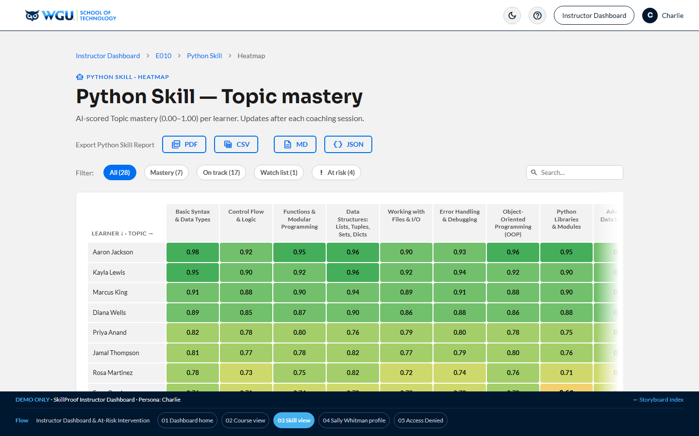

# Instructor — Charlie · v1.3

[← Back to root README](../README.md) · [Live dashboard](https://brady-wgu.github.io/SkillProof/instructor/)

## Persona

**Charlie** — Instructor for the WGU courses he teaches (E010 Foundations of Programming · E075 Intermediate Python & Libraries · E135 OOP with Python). Per the User Profile and SOW §2.5, "Instructor" includes both Course Instructors and Program Mentors. Authenticates via his own secret LRPS deep link. RBAC scopes him to learners enrolled in his courses (anonymized identifiers; rolling enrollment, no fixed cohort or section).

## Scope

Educator-facing analytics and student engagement tracking. The instructor's primary job-to-be-done in SkillProof is identifying at-risk learners and reviewing the AI Coach's interactions to decide on outreach or mentor referrals. **SkillProof is a practice tool — coaching scores never feed academic records.** Instructors observe and advise; they do not override AI scores (that's not in the contract).

## Scenarios

| ID | Description | Screens |
|:---|:------------|:-------:|
| **SC-ADD-03** | **Instructor Dashboard & At-Risk Intervention.** LRPS landing → SSO → **Instructor Dashboard** (active Courses with KPIs + Skills nested per Course card) (S1) → **Course view** (E010 detail — aggregate metrics + Skills deployed) (S2) → **Skill view = class heatmap** (Python Skill, 15 learners × 4 Topics, 9-step red→green scale; Export Course Report PDF / CSV per §7.14) (S3) → **Learner profile** (Sally's per-Topic scores) (S4) → **Access Denied** (zero-trust deny path, cross-portal pattern) (S5). Heatmap + tables carry filter + search + sort. *(Conversation-log / transcript / audit screens removed in v4.121 — conversations are single Q+A, not stored multi-turn.)* | 5 |

**Total: 1 scenario · 5 screens (sequential 1–5).**

## Source

SkillProof User Scenario Catalog: Additional Scenarios **v1.3** (05 May 2026). Authored by WGU Program Development.

Storyboard rev: **v4.160** (2 Jun 2026 — design-system polish (8-pt spacing, `.badge-lg`); AA-contrast chip removed; navbar logo → dashboard; **unified "Export ▾" dropdown** on the at-risk list, heatmap, and learner-gap tables — PDF / CSV, since instructor data is human-read).

## SOW references

§7.10–7.11 (Engagement / Educator Dashboards), §7.13 (Visualizations), §7.14 (Export capabilities), §10.4 (Audit Logs).

## Files

- [`index.html`](index.html) — interactive storyboard (5 screens)
- `screenshots/` — 5 light-theme PNGs at 1440×900 (filenames `screen-NN.png`, 1:1 with screen IDs)
- `screenshots_dark/` — 5 dark-theme PNGs

## Components introduced in this portal

- **`.heatmap-grid`** — CSS-grid heatmap with named rows/cols
- **`.heatmap-cell`** — 9-step color scale (`h1`–`h9`) from danger-tint to success-darker, with auto white text on darker shades
- **`.score-pill`** — small inline pill with low/med/high tint thresholds
- **`.section-card`** + **`.section-stat`** — instructor section-overview cards with stat counters
- **`.chip-filter`** — view + filter pill bar with active states (including red `at-risk` variant)
- Reuses the **chat-thread** pattern from School Admin's CSM thread, but with `ai` avatar variant for the SkillProof Coach

## Notes

- Heatmap on screen 3 shows 15 of 28 learners (the rest scroll vertically). The full filter chip bar at the top lets you switch between All / Mastery / On track / Watch / At risk subsets.
- Sally's row is tinted danger-pink to emphasize her at-risk status before any filter is applied.
- The **Learner profile (screen 4)** is Charlie's intervention point — per-Topic scores plus the AI Coach's "Objective miss" feedback let him decide whether to trust the AI's read and reach out. Charlie does **not** override AI scores; SkillProof is a practice tool, not a gradebook. (Conversations are single Q+A, so there is no stored multi-turn transcript screen — that surface was removed in v4.121.)
- The instructor has no audit-trail screen (removed in v4.121); the FERPA-aligned cross-School audit log lives in the Super Admin portal (→ Logs), where full source IPs are visible (they are partially masked elsewhere).
- v4.4 reframed all "Section 042" / "Spring 2026" copy to course-level. WGU's rolling-enrollment model means there are no fixed cohorts or sections — Charlie advises every learner currently active in his three courses (rolling).

## Device context

Desktop-primary. Drilling into individual learner records and reading the class heatmap is an extended-session workflow that doesn't suit mobile screens. The mobile-first commitment in Appendix A §16.2 #7.2 applies universally, so the dashboard renders responsively, but the day-to-day usage pattern assumes a desktop session.

## Underlying data model — captured from day one

The instructor surfaces per-Topic mastery (the class heatmap on screen 3) and individual learner records (screen 4). To support a deeper per-interaction drill-down later, **the question / student response / AI feedback / AI score tuple must be captured per interaction from day one of the student MVP**, even though that drill-down UI is a post-MVP capability (the multi-turn transcript + audit-trail screens were deferred in v4.121). Capturing the data early ensures that early students whose sessions occurred during the student-only MVP window are not invisible in the eventual instructor view. The MVP catalog narrative mentions storing "competency-level progress indicators and session timestamps" against the student's WGU ID (in current platform vocabulary: Topic-level aggregates); that minimum is insufficient for the SC-ADD-03 instructor experience and must be expanded to full interaction tuples (one per Learning Objective) in the v1.2 build.
