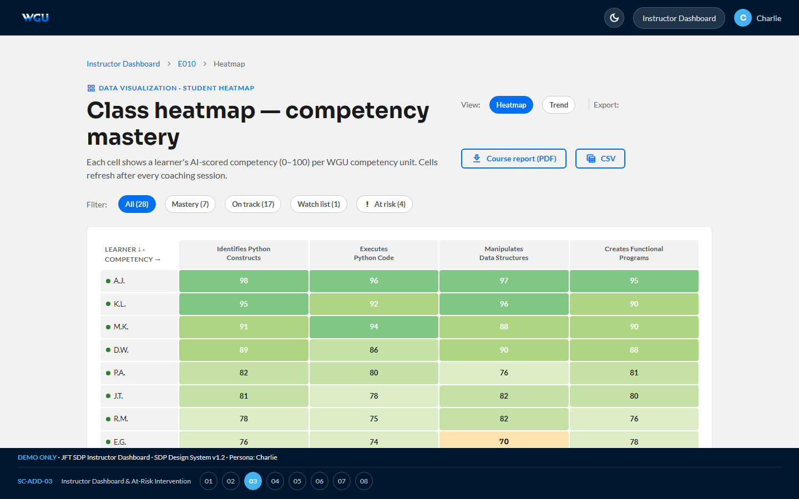

# Instructor — Charlie · v1.3

[← Back to root README](../README.md) · [Live dashboard](https://brady-wgu.github.io/SkillProof/instructor/) · [Catalog](../presentation.html#sc-add-03)

## Persona

**Charlie** — Instructor for the WGU courses he teaches (E010 Foundations of Programming · E075 Intermediate Python & Libraries · E135 OOP with Python). Per the User Profile and SOW §2.5, "Instructor" includes both Course Instructors and Program Mentors. Authenticates via his own secret LRPS deep link. RBAC scopes him to learners enrolled in his courses (anonymized identifiers; rolling enrollment, no fixed cohort or section).

## Scope

Educator-facing analytics and student engagement tracking. The instructor's primary job-to-be-done in SkillProof is identifying at-risk learners and reviewing the AI Coach's interactions to decide on outreach or mentor referrals. **SkillProof is a practice tool — coaching scores never feed academic records.** Instructors observe and advise; they do not override AI scores (that's not in the contract).

## Scenarios

| ID | Description | Screens |
|:---|:------------|:-------:|
| **SC-ADD-03** | **Instructor Dashboard & At-Risk Intervention.** LRPS landing → SSO → dashboard home (3 active courses with KPIs, no traditional sections per WGU's rolling-enrollment model) → class heatmap (15 learners × 4 competencies, 9-step red→green color scale; Export Course Report (PDF) / CSV CTAs per §7.14) → at-risk filter applied (Sally identified) → Sally drill-down (8-row per-objective scores) → conversation log list (9 sessions) → session 09 transcript with AI feedback panels inline → Audit Trail confirmation (47 messages captured, 10-row event log). | 8 |

**Total: 1 scenario · 8 screens.**

## Source

SkillProof User Scenario Catalog: Additional Scenarios **v1.3** (05 May 2026). Authored by WGU Program Development.

## SOW references

§7.10–7.11 (Engagement / Educator Dashboards), §7.13 (Visualizations), §7.14 (Export capabilities), §10.4 (Audit Logs).

## Files

- [`index.html`](index.html) — interactive storyboard (8 screens)
- `screenshots/` — 8 light-theme PNGs at 1440×900
- `screenshots_dark/` — 8 dark-theme PNGs

## Components introduced in this portal

- **`.heatmap-grid`** — CSS-grid heatmap with named rows/cols
- **`.heatmap-cell`** — 9-step color scale (`h1`–`h9`) from danger-tint to success-darker, with auto white text on darker shades
- **`.score-pill`** — small inline pill with low/med/high tint thresholds
- **`.section-card`** + **`.section-stat`** — instructor section-overview cards with stat counters
- **`.chip-filter`** — view + filter pill bar with active states (including red `at-risk` variant)
- Reuses the **chat-thread** pattern from Tenant Admin's CSM thread, but with `ai` avatar variant for the SkillProof Coach

## Notes

- Heatmap on screen 3 shows 15 of 28 learners (the rest scroll vertically). The full filter chip bar at the top lets you switch between All / Mastery / On track / Watch / At risk subsets.
- Sally's row is tinted danger-pink to emphasize her at-risk status before any filter is applied.
- The conversation transcript on screen 7 surfaces the AI Coach's "Objective miss" feedback — this is the intervention point where Charlie decides whether to trust the AI's read and reach out to the learner. Charlie does **not** override AI scores; SkillProof is a practice tool, not a gradebook.
- Source IPs in the Audit Trail (screen 8) are partially masked for the instructor view — full IPs are accessible to Super Admin only via the cross-tenant audit log.
- v4.4 reframed all "Section 042" / "Spring 2026" copy to course-level. WGU's rolling-enrollment model means there are no fixed cohorts or sections — Charlie advises every learner currently active in his three courses (rolling).

## Device context

Desktop-primary. Drilling into individual learner records and reviewing AI conversation transcripts is an extended-session workflow that doesn't suit mobile screens. The mobile-first commitment in Appendix A §16.2 #7.2 applies universally, so the dashboard renders responsively, but the day-to-day usage pattern assumes a desktop session.

## Underlying data model — captured from day one

The instructor dashboard surfaces individual learner transcripts (Screen 7) and a full audit trail (Screen 8) of AI Coach interactions. To make those surfaces meaningful, **the question / student response / AI feedback / AI score tuple must be captured per interaction from day one of the student MVP**, even though the instructor drill-down UI itself is a post-MVP capability. Capturing the data early ensures that early students whose sessions occurred during the student-only MVP window are not invisible in the eventual instructor view. The MVP catalog narrative mentions storing "competency-level progress indicators and session timestamps" against the student's WGU ID; that minimum is insufficient for the SC-ADD-03 instructor experience and must be expanded to full interaction tuples in the v1.2 build.
