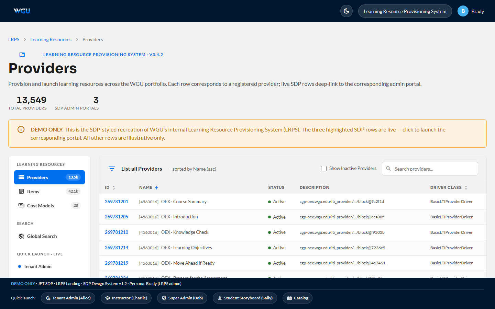

# LRPS Landing — Entry point for the admin portals

[← Back to root README](../README.md) · [Live LRPS](https://brady-wgu.github.io/JFT_SDP/lrps/)

## What this is

A recreation of WGU's internal **Learning Resource Provisioning System (LRPS)**, styled in the SDP Design System v1.2. The real LRPS is a legacy enterprise admin tool that lives behind WGU SSO; the original (linked in the storyboard) is at `lrps.wgu.edu/provision/...`. **JFT does not build LRPS** — it's modeled here only to make the deep-link source feel authentic.

## Why it exists in the storyboard

Each persona's secret LRPS deep link is what gets them into their respective admin portal. So the realistic flow is:

1. WGU staff (Brady or another LRPS admin) opens LRPS
2. They locate the appropriate provider row (e.g., "SDP Tenant Admin Portal — Course Configuration")
3. They click → deep link launches → the persona's portal opens with the SSO landing screen
4. SSO completes, role is mapped, the persona is in their portal

This LRPS landing models step 2. The three live SDP rows (Tenant Admin, Instructor, Super Admin) are clickable and deep-link straight into the corresponding portal HTML in this storyboard.

## What's in the table

| Type | Count | Behavior |
|:-----|:-----:|:---------|
| **Live SDP rows** | 3 | Clickable → launch the corresponding portal |
| **Illustrative filler rows** | 17 | Static, not clickable. Mix of real WGU LRPS provider types: OEX modules, zyBooks, Pearson MyMathLab, ProctorU, Coursera, Cicada legacy, Panopto, OEX Studio, Instructional Designer Review, etc. |
| **Inactive rows** | 1 | "Cicada PoC v1.0 (Retired)" — demonstrates the "Show Inactive Providers" toggle behavior |

The table also has a sidebar quick-launch section that links directly to the three SDP admin portals, and a meta-bar at the bottom with quick-launch chips to all 5 surfaces + the catalog.

## Files

- [`index.html`](index.html) — single-page LRPS landing
- `screenshots/lrps.png` — light-theme screenshot
- `screenshots_dark/lrps.png` — dark-theme screenshot

## Visual style

The LRPS landing was originally rendered in the legacy enterprise Bootstrap aesthetic (matching the actual internal tool). It was **restyled with the SDP Design System v1.2** in commit `e735361` so it reads as part of the SDP product family. Notable patterns:

- Standard SDP navbar (navy + WGU FY26 corporate logo + dark mode toggle + product chip + user avatar)
- Sidebar nav as an SDP card (Learning Resources / Search / Quick Launch · Live)
- `.pgn__data-table` styling for the provider table — sticky header with sortable arrow icons, status pills (green dot + "Active" / gray dot + "Inactive"), Lato monospace for description / driver-class columns
- Live SDP rows tinted Ice Blue with a 4px brand-blue left edge and a "Launch ↗" link in the actions column
- SDP-styled pagination footer with `.btn-tertiary` icon buttons and form-control pager input

## Notes

- The **DEMO ONLY banner** at the top of the table makes it clear to anyone landing here that this is a recreation, not the real LRPS.
- Container max-width is `1920px` to use the full widescreen viewport — the real LRPS is a data-dense admin tool, and the SDP's default 1192px container made the table too cramped (see commit `8704b3b` for the layout fix).
- The user avatar shows "Brady" because the real LRPS shows the logged-in WGU admin's identity. In the storyboard context, Brady is the LRPS admin who provisions the deep links for Alice, Charlie, and Bob.
