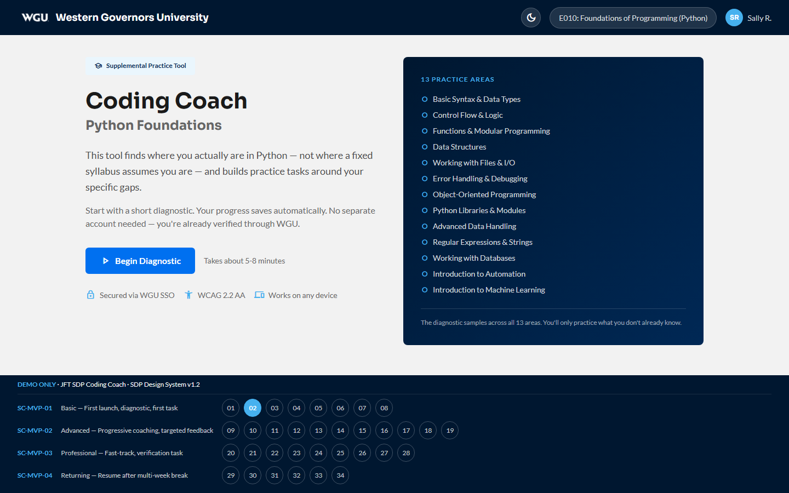

# Student — Sally · v1.2 MVP

[← Back to root README](../README.md) · [Live storyboard](https://brady-wgu.github.io/JFT_SDP/student/) · [Catalog (light)](../presentation.html#sc-mvp-01) · [Catalog (dark)](../presentation_dark.html#sc-mvp-01)

## Persona

**Sally** — WGU student in **E010 Foundations of Programming (Python)**. Knowledge level varies (Beginner / Intermediate / Advanced). Launches the Coding Coach from her zyBooks course page via LTI 1.3.

## Scope

This is the **v1.2 MVP scope** — the first JFT release. It deploys the existing Cicada v1 proof-of-concept codebase to production-quality, scalable infrastructure with a polished UI, accessible outside the WGU intranet via LTI 1.3 SSO. **No new features, adaptive logic changes, or coaching algorithm modifications are in scope for the v1.2 release.**

## Scenarios

| ID | Flow | Screens | What happens |
|:---|:-----|:-------:|:-------------|
| **SC-MVP-01** | Basic | 8 | First launch. New student with no Python knowledge completes diagnostic, views progress map, begins first coaching task, saves session. |
| **SC-MVP-02** | Advanced | 11 | Progressive coaching with targeted feedback. Partial Python knowledge → diagnostic → foundational coaching → incorrect answer with specific error feedback → gap-resolution verification → difficulty advance. |
| **SC-MVP-03** | Professional | 9 | Experienced developer fast-tracks. Diagnostic demonstrates mastery across all sub-sections. One verification task required for Functions & Modular Programming. |
| **SC-MVP-04** | Returning | 6 | Student returns after multi-week break. Prior progress preserved. Re-assessment verifies retention before resuming coaching at prior difficulty level. |

**Total: 4 scenarios · 34 screens.** *(See [v1 Known Limitations](#v1-known-limitations) below for honest call-outs of what's **not** depicted.)*

## Source

JFT SDP MVP Scenario Catalog **v1.2** (07 Apr 2026). Authored by WGU Program Development.

## SOW references

§8.1, §8.4 (LTI / fallback), §7.1–7.3 (UX / Accessibility), §6.1–6.7 (AI Orchestration / Safety).

## Files

- [`index.html`](index.html) — interactive storyboard (34 screens)
- `screenshots/` — 34 light-theme PNGs at 1440×900
- `screenshots_dark/` — 34 dark-theme PNGs at 1440×900

## Navigation

- **Arrow keys** step through screens
- **Meta-bar at bottom** has scenario-grouped numbered jump buttons
- **Theme toggle** in the top-right header (preference persists via `localStorage`)

## Notes

- **Screen 1 (zyBooks landing) is reference design only.** It illustrates the LTI 1.3 launch context as described in the v1.2 catalog — it is *not* part of the Coding Coach application or a JFT deliverable. The actual zyBooks page is owned by zyBooks/Wiley; the storyboard renders a faithful design reference so reviewers can see Sally's starting point in the textbook before she clicks the Coding Coach link.
- The student storyboard logo loads via inline base64 (legacy from v3.0). The v1.3 admin portals load logos from `../assets/` instead. This is intentional — base64 keeps the student page fully self-contained for offline LTI launch demos, even without the broader repo.

## v1 Known Limitations

Honest call-outs of what the v1 student storyboard does **not** depict. These aren't bugs — they're scope boundaries the v1.2 MVP catalog deliberately set, surfaced here so JFT and the production team know what still needs design work for v1.4+.

1. **No real Python execution.** All submitted code is evaluated by the LLM as text. There is no in-browser REPL, no sandboxed runner, no test harness. JFT must flag any of the 13 sub-sections where text-based evaluation produces unacceptable false-positive or false-negative rates — particularly anything that exercises runtime behavior, mutable state, or library imports.
2. **No mid-task pause/resume.** "Save & Exit" is only available at task boundaries (after diagnostic results, after a verification advance, after a completed task). If Sally closes the tab mid-attempt, she resumes at the **last completed task boundary**, not where she stopped — see SC-MVP-01 step 8 narrative.
3. **No error recovery flows.** The storyboard models the happy path only. There are no screens for: LTI launch failure, SSO timeout, diagnostic submission timeout, lost connectivity mid-session, LLM provider unavailable. SC-ADD-06 (Tenant Admin) covers tenant-level fallback, but the *student's* experience of an outage is undefined in v1.
4. **Re-assessment failure path not modeled.** SC-MVP-04 shows the happy path where Sally passes the 2-question retention check. What happens if she fails (e.g., she's regressed in the Intermediate band) — re-route to Foundational? Lock the session for a fresh diagnostic? Issue a tip and continue? — is undefined in v1.
5. **Coach flow detailed for only 3 of 13 sub-sections.** The narrative steps elaborate Basic Syntax & Data Types, Control Flow & Logic, and Data Structures. The other 10 sub-sections inherit Cicada v1 behavior implicitly. The chip set is shown on the Progress Map; the per-sub-section coaching loops are not visualized in the v1 storyboard.
6. **Educator feedback loop is invisible from the student storyboard alone.** The catalog assumes that Instructors (SC-ADD-03 / Charlie) can see Sally's coaching transcripts and flag at-risk patterns. That loop is depicted only in `instructor/index.html`; the student storyboard itself does not show "your coach reported X to your instructor" framing or any opt-in/opt-out for sharing.
7. **WCAG 2.2 AA §2.4.7 (Focus Visible) — heading focus indicator suppressed.** The v1 CSS at `student/index.html` line ~238 includes `h1:focus-visible, …, h6:focus-visible { outline: none; }`, which removes the standard 3px Bright Blue focus ring from headings. This was caught in the v4.6 adversarial accessibility audit. The override exists across the v1 baseline; per the freeze directive, fixing it is out of scope for v1. **All v1.3 admin portals (Tenant Admin / Instructor / Super Admin / LRPS) and the root portal selector were fixed in v4.6** — only `student/index.html` retains the violation. v1.4 student refresh should remove the override (matching the v4.6 fix in the admin portals: just delete the heading-specific override; the standard `:focus-visible` rule above it provides a compliant 3px outline).

These limitations are deliberately preserved in v1 (per WGU direction — the v1 student screens are frozen as a baseline). They are candidates for a v1.4 student refresh.

## Device context

Mobile-first per Appendix A §16.2 #7.2. WGU students access coursework on a mix of devices — phones, tablets, laptops, and from variable network conditions — so the Coding Coach must work on smaller viewports first and scale up. Progressive Web App support (§16.2 #7.7) is in scope for production. The student portal is the only surface in the storyboard where mobile is the optimization target; the three admin portals are desktop-primary.
