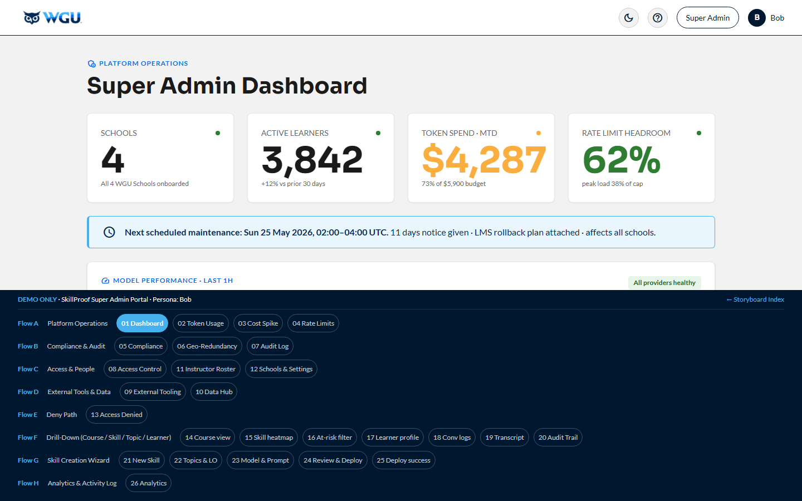

# Super Admin Portal — Bob · v1.3

[← Back to root README](../README.md) · [Live portal](https://brady-wgu.github.io/SkillProof/super_admin/)

## Persona

**Bob** — WGU platform operations and infrastructure. Authenticates via his own secret LRPS deep link **plus MFA**. Cross-tenant scope: he sees every School-tenant on the platform and is the sole controller of platform access, role elevation, and tenant lifecycle. WGU's RBAC model requires **a minimum of 2 Super Admins at all times** as a lockout-prevention guarantee. Initial WGU Super Admins are kept out of the public repo per data-hygiene policy; the generic "Bob" persona stands in for them in the storyboard.

## Scope

Cross-tenant governance, financial controls, security compliance, global resource management, role elevation, instructor-to-Skill assignment, tenant (School) lifecycle, **per-School Settings** (branding, default thresholds, retention — moved from the School Admin in v4.114), and the **full drill-chain inherited from School Admin / Instructor** (the Super Admin can dig down into any School / Course / Skill / Topic / Learner to investigate, just like a School Admin can — they just have to drill down to reach it; it's not their primary surface).

Bob's responsibilities span:

- **Cost + rate** (token usage, rate limits, cost spike drill-down)
- **Compliance + audit** (TLS 1.3, FERPA, SOC 2 / ISO 27001 / GDPR, geo-redundancy, cross-tenant audit log)
- **Access + people** (4-tier role taxonomy: Student / Instructor / School Admin / Super Admin; min-2-Super-Admins enforcement; sole elevator role; instructor roster across Schools)
- **Platform tools** (External Tooling hub: AWS / OpenRouter / Redis / Grafana / Jira / GitHub + Data & Integrations Hub)
- **Schools** (per-School lifecycle + settings: branding, default Skill passing threshold, monthly token budget, conversation/audit log retention)
- **Drill-down** (Course view → Skill heatmap → At-risk filter → Learner profile → Conv logs → Transcript → Audit Trail; New Skill wizard; consolidated 4-level Analytics)

## Scenarios

| ID | Description | Screens |
|:---|:------------|:-------:|
| **SC-ADD-04** | **Super Admin Governance, Cost Audit, Access Control, Tenant Management, and Drill-Down.** Super Admin Dashboard with 4 clickable KPI gauges + maintenance alert + Model performance (LLM SLA per provider) + Active alerts + Recent platform events + 10-card Quick Links (S1) → Token Usage Tracking with per-School breakdown (S2) → Cost spike drill-down with 30-day trend (S3) → Global Rate Limits config (S4) → Compliance Report (TLS 1.3 + FERPA + SOC 2 + ISO 27001 + GDPR + AES-256 + MFA + BC/DR) (S5) → Geo-Redundancy (3 regions + RTO/RPO targets) (S6) → Cross-tenant Audit Log (S7) → Access Control (People · Skills · Schools tabs; 4-tier roles; min-2-SA enforcement) (S8) → External Tooling hub (S9) → Data & Integrations Hub (S10) → Instructor Roster across Schools (S11) → **Schools & Settings** (4 WGU Schools as tenants + per-School Settings panel: Branding, Default Thresholds, Data Retention; `+ Create new School`) (S12) → Access Denied (S13). **Plus the inherited drill-chain (S14–S26):** Course view → Skill heatmap → At-risk filter → Learner profile → Conv logs → Transcript → Audit Trail (S14–S20) → 5-step New Skill wizard (S21–S25) → 4-level consolidated Analytics with School/Course/Skill/Topic zoom (S26). | 26 |

**Total: 1 scenario · 26 screens (sequential 1–26).**

## Source

- SkillProof User Scenario Catalog: Additional Scenarios **v1.3** (05 May 2026)
- WGU working draft **"SkillProof Authentication, Access Control, and Role Hierarchy" v1.2** (24 May 2026)
- Storyboard rev: **v4.118** (24 May 2026 — Phase 1 polish + drill-chain expansion + School Settings)

## SOW references

§6.4 (Rate Limiting), §6.6 (Token Tracking), §6.28 (GraphQL API), §8.6 (Multi-tenancy), §8.8 (Real-time + batch data export), §8.10 (API rate limiting + auth), §8.12 (Webhooks), §8.13 (GraphQL queries), §8.14 (Data streaming), §9.5 (Geo-redundancy / SLA), §10.1 (FERPA), §10.4 (Audit Logging), §10.7 (Encryption), §10.8 (RBAC), §10.13 (ISO 27001), §10.14 (Zero-trust), §10.16 (AES-256 at rest), §10.18 (MFA).

## Files

- [`index.html`](index.html) — interactive storyboard (26 screens, sequential 1–26)
- `screenshots/` — light-theme PNGs at 1440×900 (regenerate after each significant redesign)
- `screenshots_dark/` — dark-theme PNGs

## Components introduced in this portal

- **Clickable KPI gauges** on S1 — each of the 4 gauges (Schools / Active Learners / Token Spend MTD / Rate Limit Headroom) is a drill-in to the relevant downstream surface (S12 / S26 / S2 / S4 respectively); `role="button"` + `tabindex="0"` + `aria-label`
- **Compact horizontal-layout Quick Links cards** (10 cards in col-3 4+4+2 grid; reordered so Drill + Analytics + Governance lead row 1)
- **`.spike-card`** + **`.spike-chart`** — 30-bar CSS daily cost trend (no SVG; just `
` bars with height % styling); last days of spike highlighted via `.spike` and `.spike.danger` classes
- **`.util-meter`** — inline mini-bar with right-aligned numeric value (used in per-tenant token-usage table)
- **`.region-card`** — region card with side-stripe color (success / warning / danger), region name + location, stat-row table
- **`.gauge-card`** with `.center` variant and `.gauge-number` color variants (`good`, `warning`, `danger`)
- **Pending-audit-trail preview panel** on the Rate Limits screen — shows the audit log entry that will be written when "Apply" is clicked
- **4-tier role taxonomy badges** (Student / Instructor / School Admin / Super Admin) on S8, with disabled `Downgrade` button + tooltip when count = 2
- **External Tooling hub** cards on S9 linking out to AWS / OpenRouter / Redis / Grafana / Jira / GitHub
- **Data & Integrations Hub** cards on S10 (real-time + batch export · webhooks · GraphQL endpoint · Kafka/Kinesis/Pub-Sub streaming)
- **Cross-tenant Instructor Roster** on S11 with per-tenant filter dropdown (4 WGU Schools)
- **Schools & Settings** on S12 with per-School Settings panel (Branding: logo + primary color; Default Thresholds: Skill passing % + monthly token budget $; Data Retention: conversation logs + audit log)
- **Inherited drill-chain** (S14–S20, mirrored from School Admin) with navbar swapped to WGU corporate logo + Super Admin chip + Bob/B user; breadcrumbs rewritten to "Super Admin Dashboard" root
- **Inherited Skill Creation Wizard** (S21–S25) with `<input list="">` + `<datalist>` combobox typeahead for Course Number + Course Title
- **Inherited 4-level Analytics** (S26) with School Rollup → Per-Course → Per-Skill → Per-Topic; PDF / CSV / MD / JSON download per section

## Notes

- The portal models a privileged session: SSO + MFA verification + "Privileged session" warning + zero-trust line ("Server-side authorization · link does not grant access").
- **Cost spike workflow on S2–S4** is end-to-end: identify the high-consumption School (School of Technology) → drill down to see the 30-day trend with last 4 days as a visible spike → adjust rate limits → see the projected effect (MTD spend back inside budget) → "Apply" writes an audit log entry.
- **Compliance Report on S5** covers both encryption (§10.7) and FERPA (§10.1) — TLS 1.3 verification across all data paths plus FERPA privacy controls including staff training, audit retention, data deletion thresholds, and explicit FERPA control mapping to 34 CFR sections.
- **Cross-tenant audit log on S7** deliberately includes events from all v1.3 personas (Alice, Charlie, JFT CSM, system) so you can see how cross-tenant operations are surfaced to the Super Admin role.
- **User Management on S8** is the only place where role elevation happens. Default LTI baseline is `Instructor` for WGU staff; elevations to School Admin or Super Admin are applied here by a Super Admin and take effect on the user's next login. Min-2-Super-Admins is enforced via a disabled `Downgrade` button + tooltip on every Super Admin row when the count drops to 2.
- **Instructor Roster on S11** is the sole place for Skill-to-instructor mappings. SOW §2.5 lists "instructors" as a tenant-level control; WGU consolidated that under Super Admin in v4.48 because Super Admin is the sole controller of platform access.
- **Schools & Settings on S12** lists the 4 WGU Schools as tenants and exposes a `+ Create new School` affordance + per-School Settings (moved from the School Admin portal in v4.114 — TA only manages Courses + Skills now).
- **Drill-chain (S14–S26)** mirrors the School Admin's structure. The Super Admin can dig into any School / Course / Skill / Topic / Learner / Session to investigate, but this is a diagnostic capability — not the Super Admin's primary surface. Headers indicate Super Admin scope (WGU corporate logo, "Super Admin" chip, Bob/B user).
- **Score scale rule (F42)**: AI-scored values use 0.00–1.00 (heatmap cells, session scores). Human-entered passing thresholds use 0–100% (S11 LO thresholds, S13 Skill summary, S26 displays).
- **Lifecycle terminology**: Draft / Staging / Live (locked 24 May 2026; "Production" is not used).
