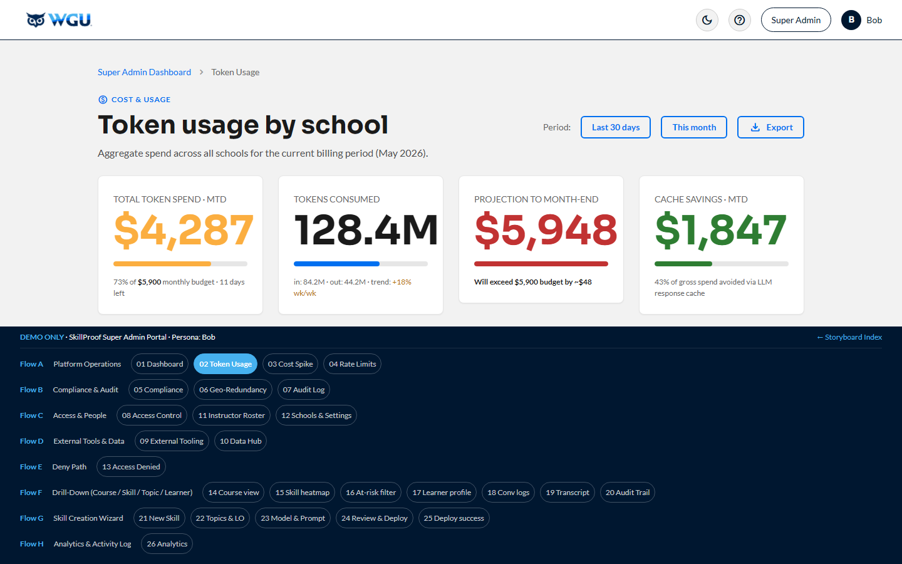

# Super Admin — Bob · v1.3

[← Back to root README](../README.md) · [Live portal](https://brady-wgu.github.io/SkillProof/super_admin/) · [Catalog](../presentation.html#sc-add-04)

## Persona

**Bob** — WGU platform operations and infrastructure. Authenticates via his own secret LRPS deep link **plus MFA**. Cross-tenant scope: he sees every School-tenant on the platform and is the sole controller of platform access, role elevation, and tenant lifecycle. WGU's RBAC model requires **a minimum of 2 Super Admins at all times** as a lockout-prevention guarantee.

## Scope

Cross-tenant governance, financial controls, security compliance, global resource management, role elevation, instructor-to-Skill assignment, and tenant (School) lifecycle. Bob's responsibilities span billing/cost (token usage, rate limits), security/compliance (TLS 1.3, FERPA, zero-trust, SOC 2 / ISO 27001 / GDPR), operational resilience (geo-redundancy, audit log, data + integrations hub), and platform access governance (user role elevation, instructor roster across Schools, creating new School tenants).

## Scenarios

| ID | Description | Screens |
|:---|:------------|:-------:|
| **SC-ADD-04** | **Super Admin Governance, Cost Audit, Access Control, and Tenant Management.** LRPS landing → SSO + MFA (SAML 2.0 SP per §16.3 #8.2; MFA per §16.5 #10.18) → portal home (KPI gauges + active alerts + recent platform events + 8 quick-link cards) → Token Usage Tracking (per-tenant breakdown with utilization meters; School of Technology flagged with spike) → cost-spike drill-down (30-bar daily cost chart, top consuming Skills, "likely cause" diagnosis) → Global Rate Limits config (form + before/after projection + pending audit-trail entry preview) → **Compliance Report — TLS 1.3 + FERPA** (encryption audit §10.7 across all data paths + FERPA privacy audit §10.1 with a 16-row FERPA control table referencing 34 CFR §§99.10 / 99.31 / 99.32 / 99.37 plus generic WGU institutional policies, and explicit SOW §16.5 control rows for SOC 2 Type II (#10.6), ISO 27001 (#10.13), zero-trust authorization (#10.14), GDPR (#10.12), annual penetration testing (#10.10), AES-256 at rest with cloud KMS (#10.16), MFA for privileged accounts (#10.18), threat detection / SIEM (#10.15), vulnerability scanning + 48-hr critical patch SLA (#10.9 + #10.19), and BC/DR with RTO ≤ 4hr + RPO ≤ 60min (#10.20)) → Geo-redundancy (3 region cards with replication lag, recent failover tests, RTO under 4-hr target) → cross-tenant audit log feed → **User Management** (4-tier role taxonomy: Student / Instructor / Tenant Admin / Super Admin; min-2-Super-Admins enforcement; sole elevator role) → **External Tooling & Integrations** (AWS / OpenRouter / Redis / Grafana / Jira / GitHub hub + global config) → **Data & Integrations Hub** (real-time + batch export, webhooks, GraphQL endpoint, Kafka / Kinesis / Pub-Sub streaming) → **Instructor Roster & Course Assignment** (cross-tenant view with per-School filter; Super Admin owns all Skill assignments) → **School / Tenant Management** (the 4 WGU Schools as tenants + `+ Create new School` affordance). | 13 |

**Total: 1 scenario · 13 screens (sequential 1-13).**

## Source

- SkillProof User Scenario Catalog: Additional Scenarios **v1.3** (05 May 2026)
- WGU working draft **"SkillProof Authentication, Access Control, and Role Hierarchy" v1.0** (13 May 2026) — drives the Super Admin naming unification, the min-2-Super-Admins enforcement banner on screen 9, the Skill-assignment authority callout on screen 12, and the new School / Tenant Management surface on screen 13.

## SOW references

§6.4 (Rate Limiting), §6.6 (Token Tracking), §6.28 (GraphQL API), §8.6 (Multi-tenancy), §8.8 (Real-time + batch data export), §8.10 (API rate limiting + auth), §8.12 (Webhooks), §8.13 (GraphQL queries), §8.14 (Data streaming), §9.5 (Geo-redundancy / SLA), §10.1 (FERPA), §10.4 (Audit Logging), §10.7 (Encryption), §10.8 (RBAC), §10.13 (ISO 27001), §10.14 (Zero-trust), §10.16 (AES-256 at rest), §10.18 (MFA).

## Files

- [`index.html`](index.html) — interactive storyboard (13 screens, sequential 1-13)
- `screenshots/` — 13 light-theme PNGs at 1440×900
- `screenshots_dark/` — 13 dark-theme PNGs

## Components introduced in this portal

- **`.spike-card`** + **`.spike-chart`** — 30-bar CSS daily cost trend (no SVG; just `
` bars with height % styling). Last days of the spike are highlighted via `.spike` and `.spike.danger` classes.
- **`.util-meter`** — inline mini-bar with right-aligned numeric value (used in the per-tenant token-usage table)
- **`.region-card`** — region card with side-stripe color (success / warning / danger), region name + location, and stat-row table
- **`.gauge-card`** with `.center` variant — KPI gauges (numeric + label + thin progress bar + target sub-text)
- **`.gauge-number`** color variants (`good`, `warning`, `danger`)
- Pending-audit-trail preview panel on the Rate Limits screen — shows the audit log entry that will be written when "Apply" is clicked
- **4-tier role taxonomy badges** (Student / Instructor / Tenant Admin / Super Admin) on screen 9, with disabled `Downgrade` button + tooltip when count = 2
- **External Tooling hub** cards on screen 10 linking out to AWS / OpenRouter / Redis / Grafana / Jira / GitHub
- **Data & Integrations Hub** cards on screen 11 (real-time + batch data export · webhook subscriptions · GraphQL endpoint · Kafka / Kinesis / Pub-Sub streaming)
- **Cross-tenant Instructor Roster** on screen 12 with per-tenant filter dropdown (4 WGU Schools)
- **School / Tenant Management** table on screen 13 with `+ Create new School` button — the affordance for adding new School-tenants as WGU expands the platform

## Notes

- The portal models a privileged session: the SSO landing on screen 1 includes an MFA verification step + a "Privileged session" warning that all actions are logged to the cross-tenant audit trail + a zero-trust line ("Server-side authorization · link does not grant access").
- Cost spike workflow on screens 3-5 is end-to-end: identify the high-consumption tenant (School of Technology) → drill down to see the 30-day trend with last 4 days as a visible spike → adjust rate limits → see the projected effect (MTD spend back inside budget) → "Apply" writes an audit log entry.
- The Compliance Report on screen 6 covers both encryption (§10.7) and FERPA (§10.1) — TLS 1.3 verification across all data paths plus FERPA privacy controls including staff training, audit retention, data deletion thresholds, and explicit FERPA control mapping to 34 CFR sections.
- The cross-tenant audit log on screen 8 deliberately includes events from all the other v1.3 personas (Alice, Charlie, JFT CSM, system) so you can see how cross-tenant operations are surfaced to the Super Admin role.
- **User Management on screen 9** is the only place where role elevation happens. Default LTI baseline is `Instructor` for WGU staff; elevations to Tenant Admin or Super Admin are applied here by a Super Admin and take effect on the user's next login. Min-2-Super-Admins is enforced via a disabled `Downgrade` button + tooltip on every Super Admin row when the count drops to 2.
- **Instructor Roster on screen 12** is the sole place for Skill-to-instructor mappings. SOW §2.5 lists "instructors" as a tenant-level control; WGU consolidated that under Super Admin in v4.48 because Super Admin is the sole controller of platform access. The info alert on screen 12 makes this explicit: "Super Admin owns all Skill assignments. Tenant Admins have no provisioning affordance."
- **School / Tenant Management on screen 13** lists the 4 WGU Schools as tenants and exposes a `+ Create new School` affordance for adding additional School-tenants. This closes the implied multi-school management gap as WGU expands SkillProof beyond the initial deployment.

## Device context

Desktop-primary, with command-line access for cloud infrastructure operations outside SkillProof. The mobile-first commitment in Appendix A §16.2 #7.2 applies universally across the storyboard, so the Super Admin portal is responsive and accessible on smaller viewports, but the operational workflow assumes a desktop session with multiple panels open at once.

## Maintenance windows and rolling enrollment

WGU operates a rolling enrollment model: students enroll on the first of any month and progress at their own pace. There is no semester break and no naturally low-traffic window for production maintenance. Maintenance strategy must therefore favor approaches that minimize or eliminate user-visible downtime: blue/green deploys (committed in §16.1 #6.24), in-place rolling updates for stateless services, and database migrations executed via online schema-change patterns. Where a downtime window is unavoidable, it should land in a designated low-risk timeframe coordinated with WGU operations at least 14 days in advance per §16.4 #9.12.

## LLM API account ownership and spend control

LLM API costs are excluded from the fixed-cost SOW per §11 Note 5 — WGU is responsible for those charges directly. Account ownership and provisioning specifics are coordinated separately between WGU IT and JFT engineering. The cost telemetry rendered in this portal (Token Usage by Tenant on Screen 3, cost-spike drill-down on Screen 4) is the primary control surface for WGU to monitor spend. The rate-limit controls on Screen 5 are the operational lever for tightening per-tenant ceilings. A per-day or per-tenant hard spend cap acting as a circuit breaker is recommended for the pilot phase; the value of that cap is a WGU operational decision.

## Pilot-to-WGU handoff transition

During the pilot phase, JFT's technical leads operate this Super Admin surface on WGU's behalf, with the platform hosted and managed under the fixed-cost SOW. At a future date, the Super Admin role transitions to WGU IT. The handoff protocol, target date, and identity-provider integration for WGU IT access to cloud infrastructure (separate from the SkillProof application console, which uses WGU SSO via SAML per §16.3 #8.2) are scoped separately and not part of the v1.x storyboard. JFT and WGU should agree the handoff plan in writing well before the SOW pilot-support period ends.
