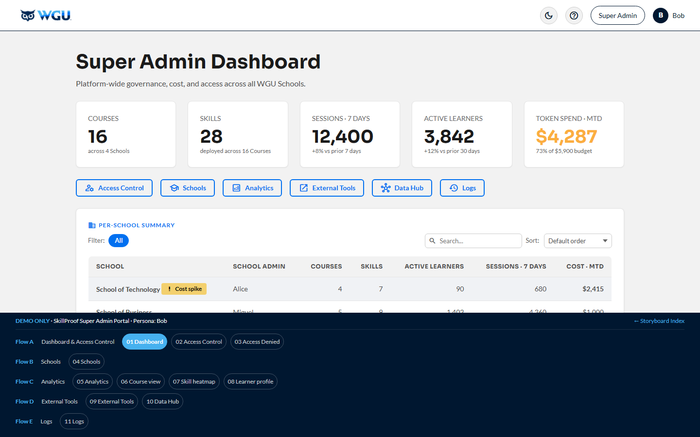

# Super Admin Portal — Bob · v1.3

[← Back to root README](../README.md) · [Live portal](https://brady-wgu.github.io/SkillProof/super_admin/)

## Persona

**Bob** — WGU platform operations and infrastructure. Authenticates via his own secret LRPS deep link **plus MFA**. Cross-tenant scope: he sees every School-tenant on the platform and is the sole controller of platform access, role elevation, and tenant lifecycle. WGU's RBAC model requires **a minimum of 2 Super Admins at all times** as a lockout-prevention guarantee. Initial WGU Super Admins are kept out of the public repo per data-hygiene policy; the generic "Bob" persona stands in for them in the storyboard.

## Scope

Cross-tenant governance, financial controls, security compliance, global resource management, role elevation, instructor-to-Skill assignment, tenant (School) lifecycle, **per-School Settings** (branding, default thresholds, retention — moved from the School Admin in v4.114), and the **full drill-chain inherited from School Admin / Instructor** (the Super Admin can dig down into any School / Course / Skill / Topic / Learner to investigate, just like a School Admin can — they just have to drill down to reach it; it's not their primary surface).

Bob's responsibilities span:

- **Cost + rate** (token usage, rate limits, cost spike drill-down)
- **Compliance + audit** (TLS 1.3, FERPA, SOC 2 / ISO 27001 / GDPR, geo-redundancy, cross-tenant audit log)
- **Access + people** (4-tier role taxonomy: Student / Instructor / School Admin / Super Admin; min-2-Super-Admins enforcement; sole elevator role; instructor roster across Schools)
- **Platform tools** (External Tooling hub: AWS / OpenRouter / Redis / Grafana / Jira / GitHub + Data & Integrations Hub)
- **Schools** (per-School lifecycle + settings: branding, default Skill passing threshold, monthly token budget, conversation/audit log retention)
- **Drill-down** (Course view → Skill heatmap → Learner profile, mirrored from School Admin) plus the consolidated 5-level Analytics (Platform → School → Course → Skill → Topic)

## Scenarios

| ID | Description | Screens |
|:---|:------------|:-------:|
| **SC-ADD-04** | **Super Admin Governance, Access Control, Schools & Data.** Super Admin Dashboard — platform KPIs + cost / budget + Per-School table + quick-links (Access Control · Schools · Analytics · External Tools · Data Hub · Logs) (S1) → **Access Control** (People · Skills · Schools tabs; 4-tier roles; min-2-Super-Admins; assignment removals confirm via modal) (S2) → Access-expired (S3) → **School Management** (per-School Settings panel: Branding, Default Thresholds, Data Retention; **+ New School = modal**) (S4) → 5-level **Analytics** (Platform → School → Course → Skill → Topic) with per-level exports (S5) → inherited Course → Skill → Learner drill (S6–S8) → **External Tooling** (AWS / OpenRouter / Redis / Grafana / Jira / GitHub launchers) (S9) → **Data & Integrations Hub** (export, webhooks, GraphQL, Kafka / Kinesis / Pub-Sub streaming, REST) (S10) → **Logs** (FERPA-aligned platform audit; export + tail-live + filters) (S11). Every table carries filter + search + sort. | 11 |

**Total: 1 scenario · 11 screens (sequential 1–11).** (Create a School is a modal, not a screen.)

## Source

- SkillProof User Scenario Catalog: Additional Scenarios **v1.3** (05 May 2026)
- WGU working draft **"SkillProof Authentication, Access Control, and Role Hierarchy" v1.2** (24 May 2026)
- Storyboard rev: **v4.152** (1 Jun 2026 — storyboard review: shared filter/search/sort, heat-scale colors, Create-a-School → modal, Access-Control removals → confirm modal, External Tooling / Data Hub de-overlap)
- Storyboard rev: **v4.156** (2 Jun 2026 — design-system polish: `.role-pill` role selectors (color-coded + visible focus ring); live **institution-branding preview** on School Management; **export-confirmation toasts**; collapsible **visualization key** on Analytics; **responsive phone-preview** card on the dashboard)
- Storyboard rev: **v4.160** (2 Jun 2026 — post-review polish: AA-contrast chip removed; filter/sort limited to analyzable tables; Logs "Result" column dropped + filter de-duped; navbar logo → dashboard; dashboard subtitle; **unified "Export ▾" dropdown** on every filtered table — PDF/CSV for people, MD/JSON for Logs / Audit trail / Webhooks)

## SOW references

§6.4 (Rate Limiting), §6.6 (Token Tracking), §6.28 (GraphQL API), §8.6 (Multi-tenancy), §8.8 (Real-time + batch data export), §8.10 (API rate limiting + auth), §8.12 (Webhooks), §8.13 (GraphQL queries), §8.14 (Data streaming), §9.5 (Geo-redundancy / SLA), §10.1 (FERPA), §10.4 (Audit Logging), §10.7 (Encryption), §10.8 (RBAC), §10.13 (ISO 27001), §10.14 (Zero-trust), §10.16 (AES-256 at rest), §10.18 (MFA).

## Files

- [`index.html`](index.html) — interactive storyboard (11 screens, sequential 1–11; Create a School is a modal, not a screen)
- `screenshots/` — 11 light-theme PNGs at 1440×900 (filenames `screen-NN.png`, 1:1 with screen IDs)
- `screenshots_dark/` — 11 dark-theme PNGs

## Components introduced in this portal

- **KPI cards** on S1 — top-line platform metrics (Courses · Skills · Sessions · Active Learners · Token Spend MTD), above a per-School summary table and quick-link buttons (Access Control · Schools · Analytics · External Tools · Data Hub · Logs)
- **`.spike-card` + `.spike-chart`** — 30-bar CSS daily-cost trend (no SVG; `
` bars with height %) on the S1 per-School cost-detail panel; recent spike days highlighted via `.spike` / `.spike.danger`
- **`.gauge-card`** (with `.center` variant + `.gauge-number` `good` / `warning` / `danger` states) and **`.util-meter`** inline mini-bars — used across the S1 cost panel and S5 Analytics
- **4-tier role pills** (Student / Instructor / School Admin / Super Admin) on S2 Access Control — color-coded, editable via a confirm modal; Super-Admin rows show a disabled `Downgrade` + tooltip when the count is 2 (min-2-Super-Admins)
- **Per-School Settings panel** on S4 School Management — Branding (logo + live primary-color preview), Default Thresholds (passing % + monthly token budget $), Data Retention; **+ New School** opens a multi-step modal
- **5-level Analytics** on S5 — Platform → School → Course → Skill → Topic, with a collapsible **visualization key** and per-section export
- **Inherited drill-chain** (S6–S8: Course → Skill heatmap → Learner) mirrored from School Admin, with the navbar carrying the WGU corporate logo + "Super Admin" chip + Bob/B user
- **External Tooling hub** on S9 — launcher cards for AWS / OpenRouter / Redis / Grafana / Jira / GitHub
- **Data & Integrations Hub** on S10 — real-time + batch export · webhooks · GraphQL endpoint · Kafka / Kinesis / Pub-Sub streaming
- **Platform Logs** on S11 — FERPA-aligned cross-tenant audit with filter + search, tail-live, and machine export
- **Responsive phone-preview** card on S1 demonstrating the dashboard reflowing to a single column
- **Unified "Export ▾" dropdown** on every filtered table (injected by the shared module) — **PDF / CSV** for human-read analytics & rosters; **MD / JSON** for the machine-read Logs, Audit trail, and Webhooks

## Notes

- The portal models a privileged session: SSO + MFA verification + "Privileged session" warning + zero-trust line ("Server-side authorization · link does not grant access").
- **Cost detail (S1):** selecting a School in the per-School table reveals its 30-day cost trend (recent days shown as a visible spike) and its top consuming Skills — the diagnostic path for a cost anomaly.
- **Role elevation lives only on S2 Access Control.** Default LTI baseline is `Instructor` for WGU staff; elevations to School Admin or Super Admin take effect on the user's next login. Min-2-Super-Admins is enforced via a disabled `Downgrade` + tooltip on every Super Admin row when the count drops to 2. Instructor-to-Skill assignment is consolidated here too (SOW §2.5 lists "instructors" as a tenant-level control; Super Admin is the sole controller of platform access).
- **Per-School configuration lives on S4 School Management** (moved from the School Admin portal in v4.114 — the School Admin now manages Courses + Skills only): Branding, default Skill passing threshold, monthly token budget, and data-retention policies, plus a `+ New School` affordance.
- **Logs (S11)** is the FERPA-aligned cross-tenant audit; it deliberately includes events from all v1.3 personas (Alice, Charlie, JFT CSM, system) so cross-tenant operations are visible to the Super Admin. Source IPs are unmasked here (they are partially masked in the Instructor view).
- **Inherited drill-chain (S6–S8)** mirrors the School Admin's Course → Skill → Learner structure — a diagnostic capability, not the Super Admin's primary surface.
- **Score scale rule (F42)**: AI-scored values use 0.00–1.00 (heatmap cells on S7, session scores); human-entered passing thresholds use 0–100% (shown in Analytics on S5). The two scales coexist platform-wide.
- **Lifecycle terminology**: Draft / Staging / Live (locked 24 May 2026; "Production" is not used).
