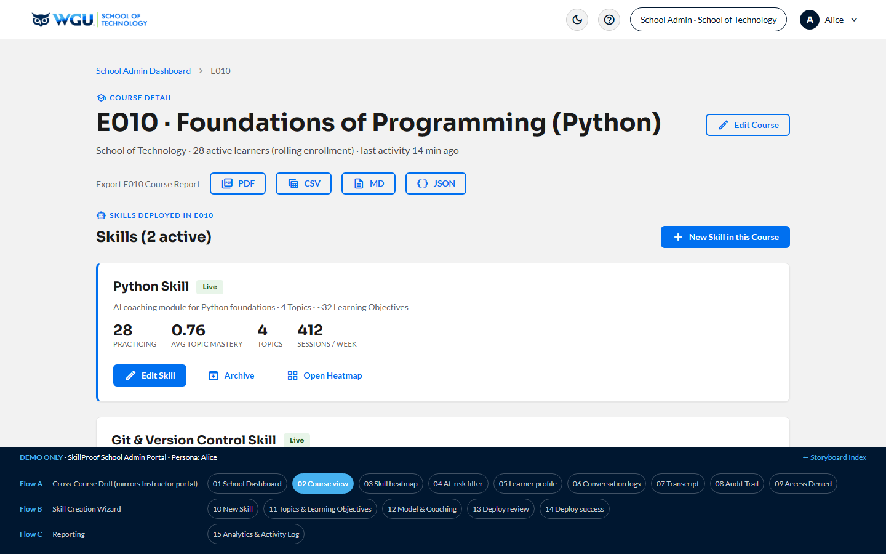

# Content Creator (Tenant Admin) — Alice · v1.3

[← Back to root README](../README.md) · [Live portal](https://brady-wgu.github.io/JFT_SDP/tenant_admin/) · [Catalog](../presentation.html#sc-add-02)

## Persona

**Alice** — WGU **Program Development (PDev) content owner**. The SOW (§2.2 deliverable list, §2.5 admin portal sub-area) refers to this role as **"Tenant Admin"** — Alice's user-facing portal chrome calls it **"Content Creator"** (per JFT meeting 10 May 2026) for ease of explanation to non-technical stakeholders. The two terms refer to the same role. Authenticates via her own secret LRPS deep link. Multi-tenant SaaS scoping limits her view to her assigned Program Subject (Foundations of Programming – Python).

## Scope

Multi-tenancy, RBAC, Course-as-a-Service course authoring (Subjects, Topics, Learning Objectives with per-LO threshold + weight), AI coaching prompt configuration, model selection, scoring style, CI/CD-driven deploys, post-deploy LRPS provisioning ticket workflow, and the Support Plan / SLA workflow (SC-ADD-06).

## Scenarios

This portal covers **two v1.3 scenarios** in one cohesive Alice experience, plus four supporting **Tenant Settings** screens accessible from the Portal home (Branding + Team & Roles + Instructor Roster + Subject Lifecycle):

| ID | Description | Screens | Screen IDs |
|:---|:------------|:-------:|:----------:|
| **SC-ADD-02** | **Content Creator Portal & Course Configuration.** Multi-tenant scoping (per-SOW §16.3 #8.6) → New Subject form → Topics & Learning Objectives **with per-LO passing threshold + weight** → **LO management deep-dive: Add LO (5) + Edit LO (6) + Remove LO (7)** with per-LO threshold/weight inputs and a hallucination-prevention warning on long LO descriptions → Configure AI Coaching Prompt (4 short text-box guardrails instead of toggle switches, with "less is more" warning to prevent hallucination) → Preferred Model picker → Scoring Style & Coaching Defaults (Socratic / Direct / Adaptive; per-LO scoring pattern table — threshold/weight have moved to the LO management screens) → Review & Deploy (5-step CI/CD Stepper: Validate → Build → Test → Deploy → Verify) → Deploy Success + **LRPS provisioning ticket** (production URL + auto-filled ticket justification + Submit to LRPS team for manual deep-link mint). **Plus four Tenant Settings:** Branding & Customization (§7.9, with default-locale dropdown + PWA install badge), Team & Role-Based Access (§10.8), Instructor Roster & Course Assignment (§2.5 + §10.8), and Subject Lifecycle & Archival (§2.5 + §10.4). | 16 | 1–12, 21–24 |
| **SC-ADD-06** | **Critical Incident Response & SLA Verification.** All-systems-operational baseline → primary LLM provider down → Fallback engaged automatically (§6.5) → notification email / toast → P1 ticket creation form in Jira (§9.1 + §9.4) → JFT-SDP-2138 confirmation → JFT Support P1 response thread within 2-hr SLA per §9.5 (CSM Jordan as WGU-facing POC per §9.1.4) → service-restored verification → SLA dashboard showing 99.97% uptime maintained. | 8 | 13–20 |

**Total: 2 scenarios · 24 screens.** SC-ADD-05 (Data Portability) was removed in v4.22 per JFT meeting 10 May 2026 — data export scope moved to the global / Super Admin portal, and the in-portal API console was replaced by external Swagger documentation per SOW §2.4 deliverable ("API specification using Swagger").

## Source

JFT SDP User Scenario Catalog: Additional Scenarios **v1.3** (05 May 2026). Authored by WGU Program Development. Storyboard rev: **v4.22** (10 May 2026 — JFT-meeting reshape).

## SOW references

| Scenario | SOW refs | Where covered |
|:---------|:---------|:--------------|
| SC-ADD-02 | §2.2 ("Tenant Admin" deliverable name), §2.5 (Admin Portal — Course Configuration, modules, instructors, analytics), §16.1 #6.7 (guardrails), #6.8 (A/B testing), #6.12 (LaTeX), §16.2 #7.6 (i18n), #7.7 (PWA), #7.9 (Custom Branding), §16.3 #8.6 (Multi-tenancy), §16.5 #10.4 (Audit logging — LO add/edit/remove events), #10.8 (RBAC) | Multi-tenant scoping callout on screen 2; LO management with threshold + weight per-LO on screens 4 + 5 + 6 + 7; Configure AI Coaching Prompt on screen 8 (4 short text-box guardrails + hallucination warning); Branding §7.9 on screen 21; Team & Roles §10.8 on screen 22; Instructor Roster §2.5 + §10.8 on screen 23; Subject Lifecycle §2.5 + §10.4 on screen 24; CI/CD Stepper on screen 11; LRPS provisioning ticket workflow on screen 12. |
| SC-ADD-06 | §6.5 (AI Fallback), §9.1 (Jira ticketing), §9.4 (Jira / ticketing channel), §9.2 (Uptime), §9.5 (SLAs), §9.7 (CSM), §9.10 (Response time), §9.13 (Monitoring) | All systems baseline → fallback → Jira ticket → CSM response thread → service restored → SLA dashboard across screens 13–20. |

## v4.22 reshape (JFT meeting 10 May 2026)

- **Renamed in user-facing UI only:** "Tenant Admin Portal" navbar chip → "Content Creator Portal"; "Tenant Admin" persona label visible to Alice → "Content Creator". SOW-referenced terminology ("Tenant Admin" per §2.2 deliverable) preserved in all official documentation, READMEs, and Doc Control rows.
- **Removed SC-ADD-05 (Data Portability)** — JFT confirmed the in-portal API console is replaced by external Swagger documentation per SOW §2.4 ("API specification using Swagger"); data export scope moved to global / Super Admin per JFT meeting note "Take out the data screen from the tenant admin and leave it on global."
- **Added 3 new LO management screens (5/6/7)** illustrating one example each of Add / Edit / Remove flows, with per-LO passing threshold + weight inputs integrated. Per WGU direction, the passing threshold is integrated into the entry/modification screens for topics/learning objectives rather than living on a separate page.
- **Screen 4 (Topics & LOs)** restructured from row-card topic list to per-LO data table with threshold + weight columns and per-row Edit/Remove icon buttons + "Add Learning Objective" CTA.
- **Screen 8 (Configure AI Coaching Prompt)** — toggle switches converted to 4 short text-box guardrails (Student profile use / Subject-domain limits / Jailbreak posture / Sandbox use) with a prominent "less is more — long fields make the model more prone to hallucinate" warning per JFT meeting note.
- **Screen 10 (Scoring & Rubric)** simplified — per-LO threshold + weight columns removed (now on screens 4–7); kept Socratic / Direct / Adaptive global coaching-style picker + per-LO scoring pattern table.
- **Screen 12 (Deploy success)** — added LRPS provisioning ticket section showing production URL + auto-filled ticket justification + Submit-to-LRPS-team CTA, per JFT meeting note "Present the destination link from JFT on the 'Deployed to Production' page. And then the tenant admin sends that in a ticket to the LRPS team manually."
- **Net screen count:** 27 → 24 (+3 new LO screens, −6 removed SC-ADD-05).

## Files

- [`index.html`](index.html) — interactive storyboard (24 screens, 2 scenario flows + 3 LO management screens + 4 supporting Tenant Settings screens)
- `screenshots/` — 24 light-theme PNGs at 1440×900
- `screenshots_dark/` — 24 dark-theme PNGs

## Components introduced in this portal

- 5-step **Stepper** for the CI/CD pipeline (Validate → Build → Test → Deploy → Verify)
- **LO management forms** (Add / Edit / Remove) with per-LO threshold + weight inputs, hallucination warnings on long descriptions, and audit-trail context
- **JSON code block** with syntax highlighting (`#0d1117` dark theme) — retained for prompt preview on Configure AI Coaching Prompt
- **Radio cards** for Model picker + global Coaching Style selector
- **File-meta card** for LRPS ticket destination URL display
- **Uptime gauge** + **SLA dashboard** with downtime budget remaining
- **Chat-thread / chat-bubble / chat-avatar** for the JFT Support P1 response thread
- **Soft-tint feedback panels** (success / warning / danger) with left-edge accent stripe

## Notes

- The "Deploy to Production" CTA triggers the simulated CI/CD pipeline. The Stepper component models the live progression through Validate → Build → Test → Deploy → Verify with status badges per step.
- After deploy, the **LRPS provisioning ticket** workflow on screen 12 is a manual handoff: JFT does not write to LRPS; the WGU D&D team owns provisioning. The screen shows the production URL + auto-filled ticket justification for Alice to submit.
- Tenant scoping is enforced at every layer: Subject creation locks the Program Subject field; deploys are audit-logged per SOW §10.4.
- The chat thread on screen 18 demonstrates the JFT Support P1 response SLA (§9.5, <2-hr target). CSM Jordan is shown as the WGU-facing POC (§9.1.4); the SLA itself is owned by JFT Support, not the CSM. First reply at 6 minutes, full resolution at 1h 24m.

## Device context

Desktop-primary. Course authoring, AI prompt configuration, and deploy workflows are not well-suited to mobile screens. The mobile-first commitment in Appendix A §16.2 #7.2 applies universally, so the portal renders responsively, but the optimized workflow assumes a desktop session.

## Tenant Admin portal as the configuration path for the full SOW

The Content Creator / Tenant Admin portal **is** the production configuration mechanism for the SDP across all WGU PDev courses. The v1.2 student-only MVP was bootstrapped by JFT engineers via Git-versioned config for E010; once SC-ADD-02 ships, all subsequent course onboarding (E075 Intermediate Python & Libraries, E135 OOP with Python, and any future courses outside Python entirely) flows through this portal. The portal is not optional MVP-extension scope — it is part of the binding Appendix A §16.3 #8.6 multi-tenancy commitment and the §2.5 Admin Portal deliverable. WGU expects JFT to deliver it within the contracted engagement window.

## LRPS provisioning is a manual WGU-side handoff

The LRPS provisioning ticket workflow on screen 12 is intentionally a manual handoff — JFT does not write to LRPS. WGU's distributed LMS architecture (the LRPS provider table on `lrps/index.html` illustrates this) means generic "LTI 1.3 compliance" alone is not sufficient for end-to-end course launch; the WGU D&D team registers and provisions LRPS deep links separately. JFT's responsibility is to expose a stable launch URL that does not change when courses are reorganized. Custom LRPS integration work, if needed beyond what LTI 1.3 covers, should be scoped explicitly rather than assumed.
