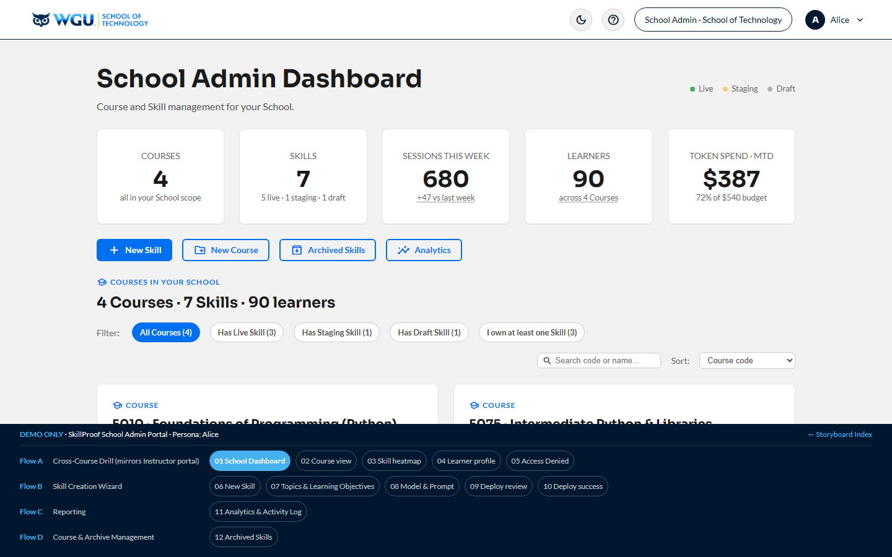

# School Admin Portal — Alice · v1.3

[← Back to root README](../README.md) · [Live portal](https://brady-wgu.github.io/SkillProof/tenant_admin/)

## Persona

**Alice** — WGU **Program Development (PDev)** employee, operating within the **School of Technology**. The SOW (§2.2 deliverable list, §2.5 admin portal sub-area) is the contract source for this role; throughout the storyboard chrome and all documentation the role is called **"School Admin"** (per Brady's terminology lock, 24 May 2026), since the SOW's own language is contract-specific and confuses readers outside the small dev team. Alice authenticates via her own secret LRPS deep link and is scoped to her School(s) — currently School of Technology, where she manages Skills like Foundations of Programming (Python) and OOP with Python.

## Scope (refined 24 May 2026)

**The School Admin manages Courses and Skills.** Specifically: Course-as-a-Service authoring (Skills, Topics, Learning Objectives with per-objective passing thresholds), AI coaching prompt configuration, model selection, CI/CD-driven deploys to Staging or Live, post-deploy LRPS provisioning ticket workflow, Skill lifecycle (Draft / Staging / Live + Archive), and per-Skill analytics across School / Course / Skill / Topic levels.

The following are **out of scope** for the School Admin (delegated elsewhere):

| Out-of-scope concern | Owner | Reason |
|:---|:---|:---|
| At-risk learner identification + intervention | **Instructor** | Per-learner remediation is Charlie's job. Alice can drill into the heatmap and learner profile for diagnostic purposes if a Skill is misbehaving, but at-risk monitoring is not her primary surface. |
| Incident response / SLA monitoring | **JFT Support** (one-way only) | No 2-way help-desk communication; Alice clicks the help icon for a Zendesk handoff. No P1 ticketing UI, no CSM threads, no service-degradation dashboard. |
| School Settings (branding, thresholds, retention) | **Super Admin** | Per-School configuration of branding, default Skill passing threshold, monthly token budget, and data retention policies all live in the Super Admin portal (super_admin/ → S4 School Management). |
| Cross-School operations | **Super Admin** | Bob owns role elevation, instructor roster across Schools, External Tooling, Data Hub, Geo-Redundancy, Compliance, and cross-School audit. |

## Scenarios

| ID | Description | Screens |
|:---|:------------|:-------:|
| **SC-ADD-02** | **School Admin Portal & Skill Configuration.** School Dashboard — KPI rollup + Course cards (Skills as inline actions) + filter / search / sort (S1) → Course → Skill → Learner drill mirroring Instructor (S2–S4) → Access Denied (S5) → 5-step **New Skill** wizard (S6 Skill details with Course combobox → S7 Topics & Learning Objectives with 0–100% thresholds → S8 Model & AI prompt → S9 Deploy review → S10 build success + LRPS provisioning ticket) → Analytics & Reporting with 4-level zoom + Program Reports + Audit Trail (S11) → Archived Skills with Restore / Permanently-delete (S12). **New Course** opens a **modal** from the dashboard (form → confirm → success); the Archived "permanently delete" confirms via modal. Every table carries filter + search + sort. | 12 |

**Total: 1 scenario · 12 screens (sequential 1–12).** (New Course is a modal, not a screen.)

## Source

- SkillProof User Scenario Catalog: Additional Scenarios **v1.3** (05 May 2026)
- WGU working draft **"SkillProof Authentication, Access Control, and Role Hierarchy" v1.2** (24 May 2026)
- Storyboard rev: **v4.152** (1 Jun 2026 — storyboard review: shared filter/search/sort, heat-scale colors, New Course → modal, Archived delete → confirm modal)
- Storyboard rev: **v4.156** (2 Jun 2026 — design-system polish: 8-pt spacing + sanctioned `.badge-lg`; **export-confirmation toasts**; collapsible **visualization key** on Analytics & Reporting)
- Storyboard rev: **v4.160** (2 Jun 2026 — post-review polish: AA-contrast chip removed; filter/sort limited to analyzable tables (off Topics/LOs + model picker); Activity-Log "Result" column dropped; navbar logo → dashboard; dashboard subtitle; **unified "Export ▾" dropdown** on every filtered table — PDF/CSV for analytics, MD/JSON for the Activity Log)

## SOW references

| Scenario | SOW refs | Where covered |
|:---------|:---------|:--------------|
| SC-ADD-02 | §2.2 (School Admin deliverable), §2.5 (Admin Portal — Skill Configuration), §6.7 (guardrails), §6.8 (A/B testing), §6.12 (LaTeX), §7.10 (engagement), §7.11 (educator analytics), §7.12 (usage stats), §7.13 (visualization), §7.14 (report exports), §8.6 (Multi-tenancy), §9.7 (CSM — referenced via Help link, not embedded), §9.14 (self-service support — Help icon in every navbar), §10.4 (Audit logging — Activity Log embedded in Analytics S11), §10.8 (RBAC), §10.14 (zero-trust) | Course/Skill scoping callout on every screen; New Skill wizard with combobox Course picker on S6; topic + LO expanders with passing thresholds on S7; Model & Prompt config (5 guardrail fields) on S8; deploy step summary on S9; LRPS provisioning ticket on S10; Analytics 4-level zoom on S11 (with the Activity Log embedded); Help icon links out to Zendesk. |

## Files

- [`index.html`](index.html) — interactive storyboard (12 screens, sequential 1–12; New Course is a modal, not a screen)
- `screenshots/` — 12 light-theme PNGs at 1440×900 (filenames `screen-NN.png`, 1:1 with screen IDs)
- `screenshots_dark/` — 12 dark-theme PNGs

## Components introduced in this portal

- **`<input list="">` + `<datalist>` combobox typeahead with add-new** — on S6 New Skill, for Course Number + Course Title pickers. Native HTML5; supports typing to filter the existing list AND typing a new value to create a new Course.
- **5-step wizard** with consistent `Step N of 5` eyebrows + Back/Next floating-actions
- **Topic expanders** (`
` / `
` with caret rotation) carrying inline editable LO text + per-LO passing threshold (0–100%) + inline Add / Remove (Remove is freely enabled in the create wizard; would be disabled in a future Edit-Live-Skill flow)
- **Skill cards** on S2 Course view with Edit (primary, blue) + Archive (tertiary) + Open Heatmap (tertiary) action row — Edit is the TA's primary maintenance affordance, heatmap is the diagnostic drill-in
- **Filter chips + sort dropdown + text-search** on S1 above the Course grid — handles many-Course scenarios (E010 / E075 / E120 / E135 in demo; designed to scale)
- **Analytics 4-level zoom** on S11: School Rollup (KPI gauges + trend charts) → Per-Course (table + h-bar comparisons) → Per-Skill (lifecycle-badged table) → Per-Topic (filterable 20-row table for spotting Skill prompt bugs via cost/mastery anomalies)
- **Unified "Export ▾" dropdown** on every filtered table (injected by the shared module) — **PDF / CSV** for human-read analytics; **MD / JSON** for the machine-read Activity Log
- **CI/CD pipeline stepper** on S9 (Validate → Build → Test → Deploy → Verify) — visualizes the deployment process triggered by Deploy to Live
- **LRPS provisioning ticket workflow** on S10 — auto-fills the production URL + ticket justification for a mailto handoff to wgu-lrps-support@wgu.edu (one-way; JFT does not write to LRPS)

## Notes

- The "Deploy to Live" CTA triggers the simulated CI/CD pipeline shown via the 5-step Stepper on S9. The Stepper component models the live progression through Validate → Build → Test → Deploy → Verify with status badges per step.
- After deploy, the **LRPS provisioning ticket** workflow on S10 is a manual handoff: JFT does not write to LRPS; the WGU D&D team owns provisioning. The screen shows the production URL + auto-filled ticket justification for Alice to submit.
- Course scoping is enforced at the New Skill wizard: Course Number + Course Title are the first fields, both editable combobox inputs with add-new capability. Existing Course Numbers (E010, E075, E120, E135) populate the dropdown; typing a new code (e.g., `E180`) creates a new Course.
- The **drill-chain (S2–S4)** mirrors the Instructor portal's structure but is reached via the School Admin's flow. Headers indicate School Admin viewing; data is the same heatmap / learner profile / conversation logs that Charlie would see. This is a diagnostic capability for the School Admin, not the primary surface.
- The wizard's Step 3 (Model & Prompt, S8) is intentionally before Step 4 (Review & Deploy, S9) — model + AI prompt are chosen before the final pre-deploy review.
- **Score scale rule (F42)**: AI-scored values use the 0.00–1.00 scale (heatmap cells, session scores, KPI mastery averages). TA-entered passing thresholds use the traditional 0–100% scale (S7 LO thresholds, S9 deploy summary, S11 Analytics display). The two scales coexist platform-wide.
- **Lifecycle terminology**: Draft / Staging / Live (locked 24 May 2026; "Production" is not used). The Deploy review screen offers "Deploy to Staging" and "Deploy to Live" as the two deploy paths.

## Device context

Desktop-primary. Course authoring, AI prompt configuration, and deploy workflows are not well-suited to mobile screens. The mobile-first commitment in Appendix A §16.2 #7.2 applies universally, so the portal renders responsively, but the optimized workflow assumes a desktop session.

## School Admin portal as the configuration path for the full SOW

The School Admin portal **is** the production configuration mechanism for SkillProof across all WGU Schools. The v1.2 student-only MVP was bootstrapped by JFT engineers via Git-versioned config for E010; once SC-ADD-02 ships, all subsequent Skill onboarding (E075 Intermediate Python & Libraries, E135 OOP with Python, E120 Applied Data Structures, and any future Courses across the other 3 WGU Schools) flows through this portal. The portal is not optional MVP-extension scope — it is part of the binding Appendix A §16.3 #8.6 multi-tenancy commitment and the §2.5 Admin Portal deliverable.
